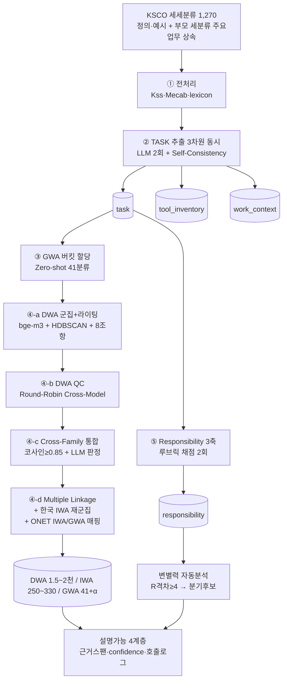

# 직무활동 4계층 도출 방법론 설계서 — TASK → DWA → IWA → GWA

> 작성: 2026-05-29 · v1.0
> 위치: `04_framework_design/docs/12_도출방법론_설계서.md`
> 상위: `00_프레임워크_종합설계서_v1.md`(v1.4) · `01_ONET_방법론_정렬_검증.md` · `02_소스데이터_우선순위_분석.md` · `03_CBM_설명가능AI_정합성_분석.md` · `10_파이프라인_사양서.md`
> **위상**: 분산된 도출 방법론을 *단일 결정완료* 설계서로 통합한다. "KSCO(세세분류 1,270을 도출 단위로, 부모 세분류 주요업무 상속)를 입력으로 TASK→DWA→IWA→GWA 4계층을 **어떤 분류 기준·AI 알고리즘·AI 기법**으로 도출하는가"를 한 문서로 확정한다. 본 문서는 **코딩 착수 전 승인 기준선**이다.
>
> ---
> 🔴 **[2026-06-08 상위 권위 이관] 본 문서는 부분 구식 — 최신 권위 = `stages/00~Stage4` + `stages/05_통합설계_검토서.md`**
> 단계별 재설계(2026-06)에서 다음이 **변경·폐기**되었다. 충돌 시 **stages/ 폴더가 우선**한다.
> - **GWA 도출**: ~~top-down 41 버킷을 TASK 단계에서 선할당~~ → **순수 상향식(TASK→DWA→IWA→GWA) + Stage4에서 ONET41 하이브리드 채택/탐색비교**.
> - **TASK→DWA**: ~~1차 1:1~~ / ~~무제한 개수~~ → **Multiple Linkage ≤3(네트워크)** · **직업당 8~30(ONET 준거)**.
> - **군집**: ~~HDBSCAN~~ → **계층적 응집군집**(노이즈 -1 제거).
> - **모델**: ~~GPT cross-check~~ → **Opus 4.8 단독**(구독). **현 범위 = Stage 0~4(TASK→GWA 완성)만**, R3축·변별력은 후속.
> - 본 §0 결정 로그(D0 세세분류 상속, 임베딩 bge-m3 등 다수)는 **여전히 유효**하되, 위 항목만 stages/로 대체.

---

## §0. 결정 로그 (Decision Log) — 통계청·학회 방어용

본 연구의 도출 방법론은 6개 선행 문서에 분산되어 있었고 일부 충돌이 있었다. 아래 결정으로 통합·확정한다.

| ID | 쟁점 | **확정** | 근거 | 대체된 문서 |
|---|---|---|---|---|
| **D0** | TASK 도출 단위 | **세세분류 5자리 1,270 단위 도출 + 부모 세분류 주요업무·정의 상속(2-pass 특화)**. DWA·IWA·변별력은 세분류로 집계 | ① ONET occupation 입자도 정합 ② 주요업무는 세분류에만 존재(0/1,270) → 상속 필수 ③ 직무특성 반영 | 구 D0(세분류 495 단위 도출) |
| **D0-1** | 데이터 우선순위 | **콘텐츠(정의·주요업무·예시)는 KSCO 전적 사용. KECO·한국직업사전은 후순위** — KECO는 Job Family 군집 *키*로만(콘텐츠 아님), 직업사전은 빈약 세세분류 보강용 deferred | 연구책임자 지시 | — |
| **D1** | 차원 범위 | **업무 + 도구 + 환경 3차원 동시 추출** + Responsibility 3축. 단 **도구·환경은 "KSCO 명시 단서만 + 근거스팬 필수 + 빈값 허용 + 커버리지 직업군별 리포팅"**. 지식·기술·능력은 O*NET 매핑 슬롯만 | doc04 C1 결정 + §1.5 실증 | doc00 §0.1(도구·환경 OUT) |
| **D2** | Job Family 단위 | **KECO 중분류 40 (실측)** — 군집은 이 40 버킷 단위 실행 | `mapping_ksco_keco` 40개 실측 적재 | doc00("KECO 24") |
| **D3** | DWA 채택 임계 | **기본 4 task or 3 직업** + 파일럿(중분류 28·22)서 **3/2 병행 비교 → M+2 확정** | 한국 데이터 규모 미검증, 섣부른 고정 금지 | Charter("3/2") |
| **D4** | 파이프라인 단계 명명 | **5단계**(① 전처리 ② TASK ③ DWA ④ IWA ⑤ Responsibility) | R3축은 본 연구 핵심 차별화 → 독립 단계 격상 | Charter("4단계") |
| **D5** | 재현성 | 모든 LLM 호출 **temp=0 / seed 고정 / `llm_call_log` 적재 / 결과 캐시** (예외 없음) | 학회·통계청 재현성 요구 | (전 문서 공통) |
| **D6** | 변별력 산출 경로 | **1차: 세세분류(L0, 이미 적재된 1,253 정의) R격차** — 같은 세분류 내 자식 세세분류 간 R3축 격차로 *과소변별* 세분류 자동 탐지. **2차(deferred): L1 직업사전 적재 후 source_subject별 R격차(치킨집 수준)** — 시범 검증 후 보강 | 목적 #1을 외부 의존 없이 즉시 산출, 통계청 표준단위 정합 | doc00/10의 source_subject 단일 의존 |

### §0.1 본 연구 5대 차별화 (위반 시 중단·보고)
1. 3차원 동시(업무+도구+환경) — 1회 호출, 추가비용 0
2. Responsibility 3축(관리·감독·안전) 정량화 — ISCO-28 SLF Responsibility 구현
3. ONET Work Activities 2014 절차 1:1 차용(3-pass·8조항·Multiple Linkage·Round-Robin·Cross-Family)
4. 2-모델 cross-verification(Claude Opus 4 + GPT-5)으로 인간 팀 다양성 대체
5. DuckDB 단일파일 — 전 중간·최종 데이터 통합

---

## §1. 입력 — KSCO DB (도출 단위 세세분류 1,270 + 부모 세분류 495 상속)

### §1.1 도출의 원천 자료

| 자원(DuckDB) | 내용 | 도출에서의 역할 |
|---|---|---|
| `ksco_occupation` 세세분류(1,270) | 정의(98.7%) + `examples_text`(44%) — **주요업무 없음** | **TASK 도출 단위(D0)** + 특화 신호(Pass 2) |
| `ksco_occupation` 세분류(495) | 정의(98%) + `main_tasks_text`(78.8%) | **부모 상속 골격(Pass 1)** — 주요업무가 여기에만 존재 |
| `main_tasks_items` (2,367) | 주요업무 1글머리 = 1행(세분류 단위) | 상속 활동 메뉴 + 규칙기반 1차 추출 |
| `job_examples` (7,622) | 직업예시 1직업 = 1행 | 세세분류 특화 신호 + 미시 변별 근거 |
| `mapping_ksco_keco` (495) | KSCO ↔ KECO 중분류 40 | **Job Family 군집 키(D2)** — 콘텐츠 아닌 구조용 |
| 한국직업사전(후순위) | N:1 매핑 | 빈약 세세분류 보강(deferred, blocking 아님) |
| `external_ref.onet_*`(예정) | GWA 41 / IWA 332 / DWA 2,069 | GWA 할당·IWA 비교 기준 |

### §1.2 소스 우선순위 — 3-Layer (doc02)

```
L0 KSCO 해설서 (가중 1.0, 전 직업 495)         ← PRIMARY
   └ 트리거 미충족 시 충분
L1 한국직업사전 (가중 0.7, 조건부)             ← SECONDARY (망라성·변별력)
   └ source_subject 메타로 원 직업명 보존
L2 NCS 능력단위 (가중 0.5, 극단 부족 <5%)      ← TERTIARY
```
**Layer 승급 정량 트리거**: ① 추출 task < 8 ② 주요업무 섹션 누락 ③ 정의 < 80자 ④ R점수 자기일치 < 0.7 ⑤ 군집 미배치 ≥ 30%.

### §1.5 도구·환경 추출 실증 (실제 주요업무 텍스트 확인 결과)

KSCO 텍스트에서 도구·환경이 실제로 추출되는지 4개 직업군을 실측했다.

| 직업 | 도구 신호 | 환경 신호 | 근거 발췌 |
|---|---|---|---|
| 7521 항공기정비원 | **강** | **강** | "시험 측정 기구를 사용하여 진단", "안전하게 운행", 공장/운항정비 |
| 6131 낙농종사원 | 중 | 중~강 | "기계 및 장비를 정비", "도구를 구입", 농장·가축 |
| 2221 컴퓨터시스템전문가 | 중~강 | 중 | "컴퓨터 구조 설계", SW·HW·DB, "고객과 협의", "팀의 일원" |
| 2812 회계사 | 약 | 중 | "회계시스템"(일반어), "회계법인…에서 일하며", "사업현장 감사" |

**정직한 한계**: KSCO 해설서는 행정·표준화 텍스트로 도구·환경이 *체계적으로* 기술되지 않는다(O*NET도 도구·환경은 본래 직무정의문이 아니라 별도 incumbent 설문 산출물). 따라서 KSCO 단독 추출은 **"명시된 것만, 추측 금지, 근거스팬 필수, 빈값 허용, 커버리지는 직업군 의존"**. 망라성이 필요하면 L1(직업사전)·O*NET 매핑으로 보강(차기 과제).

---

## §2. 4계층 분류 기준 (무엇이 TASK·DWA·IWA·GWA인가)

| 계층 | 추상 수준 정의 | 입자도 | 규모(목표) | 소속 판정 기준 |
|---|---|---|---|---|
| **TASK** | **세세분류(직업)별** 개별 작업 진술 "동사+목적어(+수단/맥락)" | 가장 구체 | 세세분류당 5~20 / 전체 8~20천 | 단일 주동사·**직무 특정**(부모 세분류 주요업무를 세세분류 정의로 특화)·일반진술과 예시나열 제외 |
| **DWA** | 여러 직업이 공유하는 중간추상 작업활동 진술 | 중간 | 1,500~2,000 | **같은 GWA 버킷 + 같은 Job Family 내** 의미유사 TASK 군집 → 8조항 라이팅 |
| **IWA** | DWA를 한 단계 더 일반화, Job Family 횡단 | 상위 | 250~330 | 정련 DWA 재군집 → ONET IWA 332 비교(코사인 < 0.55 = 한국 신규) |
| **GWA** | 최상위 일반화 작업활동(ONET 41 표준) | 최상위 | 41 (+한국 신규 1~4) | IWA → GWA 매핑. **TASK 단계서 버킷팅 키로도 선행 사용** |

### §2.1 GWA의 이중 역할 (ONET 설계 차용 — 반드시 인지)
ONET 41 GWA는 두 곳에 쓰인다.
- **선분할 버킷(top-down, Step ③)**: TASK 군집 공간을 41개로 미리 쪼갠다. 같은 GWA끼리만 군집 → 노이즈·연산량 감소.
- **최상위 정점(bottom-up, Step ④-d)**: 한국 IWA를 다시 ONET 41 GWA로 매핑 → 4계층의 꼭대기.

ONET 41 GWA는 4개 상위 영역으로 구성: **정보 입력(Information Input) · 정신적 처리(Mental Processes) · 작업 산출(Work Output) · 타인과 상호작용(Interacting with Others)**. 41개 세부 GWA의 한국어 라벨·정의는 `external_ref.onet_gwa` 적재 후 Claude Opus 4 **1회 일괄 번역(캐시)** 하여 `gwa.kr_label`에 저장(코딩 단계).

---

## §3. 파이프라인 전체 그림



---

## §4. 단계별 방법론 — 분류기준 · AI 알고리즘 · AI 기법 · 출력

### ① 전처리 (preprocess)
| 항목 | 내용 |
|---|---|
| 분류기준 | 문장 단위 정규화, Layer 메타(L0/L1/L2) 부착 |
| AI 알고리즘/기법 | **Kss** 문장분할 + **Mecab-ko** 형태소 + lexicon 동의어 정규화. 정의문 "28120 회계사…" 5자리 헤더 노이즈 제거 |
| 출력 | `processed_sentences.parquet` |

### ② TASK 추출 (세세분류 단위 + 세분류 상속, 3차원 동시) — **2-pass LLM 추출 + Self-Consistency**
| 항목 | 내용 |
|---|---|
| **도출 단위(D0)** | **세세분류 5자리** 1건씩. 입력 = `부모 세분류 주요업무`(활동 골격·상속) + `부모 세분류 정의` + `세세분류 정의`(특화 신호) + `세세분류 직업예시`. ※ 주요업무는 세분류에만 존재(0/1,270)하므로 상속 필수 |
| **2-pass 특화** | **Pass 1**: 부모 세분류 주요업무·정의로 TASK 풀 생성. **Pass 2**: 세세분류 정의·예시로 *선별·특화*(목적어 구체화 + 세세분류 고유 활동 추가, 무관 TASK 제거). → 정보부족·범용성 동시 해소 |
| 분류기준 | ONET task statement 규약: 단일 주동사 / 복합행동 분할 / 일반진술·예시나열 제외. 도구·환경은 **명시 단서 + 근거스팬만**(추측 금지, 빈값 허용) |
| AI 알고리즘 | 규칙기반 1차(동사+목적어 정규식) → **Claude Opus 4** LLM 추출 **temp=0, seed=0·1 2회 독립** |
| AI 기법 | ① **Self-Consistency**: set=(verb,object), Jaccard ≥ 0.85 → 교집합 채택(conf 0.95) ② 미달 시 **Cross-Model 다수결**: GPT-5 추가, 3-set 중 2회↑ 채택(conf 0.75 + 검토큐) ③ **JSON 강제** + 파싱 오류 재시도 3회 ④ **캐시 + `llm_call_log`** |
| 출력 | `task`(ksco_code=세세분류 5자리, parent_세분류, verb·object·full_statement·source_sentence·confidence·layer·source·source_subject·extraction_runs·cross_consistency) / `tool_inventory` / `work_context` |
| 게이트 | 세세분류당 task < 5 **또는 정의 < 50자(이름만)** → 저신뢰 플래그 → 직업사전(L1) 보강 *후순위 큐*(blocking 아님) |

### ③ GWA 버킷 할당 (Step 3b) — **Zero-Shot 단일라벨 분류**
| 항목 | 내용 |
|---|---|
| 분류기준 | TASK의 **주된 작업활동 1개만** → ONET 41 GWA 중 정확히 1개. 동사 의미 추적, 명사(목적어) 무시, "해당없음" 금지 |
| AI 알고리즘/기법 | **Zero-shot 분류**(in-context로 41 GWA 정의 제공). 2회 독립 일치 → 자동 채택 / 불일치 → GPT-5 다수결 |
| 출력 | `task.primary_gwa_id` |
| 임계 | **할당 자기일치율 ≥ 0.80** |

### ④-a DWA 군집 + 라이팅 (Step 3c) — **임베딩 + 밀도군집 + 제약조건부 생성**
| 항목 | 내용 |
|---|---|
| 분류기준 | 같은 GWA 버킷 + 같은 Job Family 내, 의미유사 TASK ≥ 4건 군집 |
| AI 알고리즘 | **bge-m3 임베딩**(1024d, L2 정규화) → **HDBSCAN**(min_cluster_size=4, min_samples=2, metric=euclidean, eom). **GWA 버킷 단위로** 실행 |
| AI 기법 | 군집중심 5 TASK → LLM **제약조건부 생성(8조항)** → **자동검증**(dwa_rules.py: 어미·명사수·금지일반어·예시구·목적절·길이) 위반 시 **재호출 루프(max 3)** |
| 8조항 | ①단일 주동사 시작 ②현재 서술형 어미 통일 ③명사 최소·"또는" 연결 ④Job Family 수준 일반화(과일반/과특수 금지) ⑤맥락 형용사 ⑥예시구 회피 ⑦목적절 최소 ⑧중2 가독성 |
| 출력 | `dwa`(label·main_verb·cluster_size·mean_cosine·eight_rules_passed) + `task_to_dwa` |

### ④-b DWA QC (Step 3d) — **Round-Robin Cross-Model 검증**
| 항목 | 내용 |
|---|---|
| 4기준 | 군집동질성(코사인 ≥ 0.70) / task-군집적합(≥ 0.65) / 특수성 / 유일성(타 DWA < 0.75) |
| AI 기법 | R1 **Opus** → R2 **GPT-5** 교차. 둘 다 pass=통과 / reject 하나라도=기각 / 그 외=**flagged(전문가 검토큐)** |
| 채택임계 | **D3**: 4 task or 3 직업 (+ 파일럿 3/2 병행) |
| 출력 | `qc_log`(round1·round2·final_status) · `dwa.qc_passed` |

### ④-c Cross-Family DWA 통합 (Step 4a) — **유사도 그래프 + LLM 동일성 판정**
| 항목 | 내용 |
|---|---|
| 분류기준 | 코사인 ≥ 0.85 & 서로 다른 Job Family 쌍 |
| AI 기법 | 후보 쌍 → LLM `same_concept` 검증 → task 풀 합쳐 8조항 재라이팅, `is_cross_family=TRUE` |
| 임계/활용 | **목표 비율 10~20%**(ONET ≈ 12%). 산업 간 **직업 전환 가능성** 기초자료 |

### ④-d Multiple Linkage + 한국 IWA 도출 + ONET 매핑
| 항목 | 내용 |
|---|---|
| Multiple Linkage | TASK당 **≤ 3 DWA, 동일 Job Family 내만**. `task_to_dwa.link_order ∈ {1,2,3}` |
| 한국 IWA | 정련 DWA **재임베딩 → HDBSCAN 재군집 → 8조항 + 1단계 추상 라이팅**. 목표 250~330 |
| ONET 비교 | 한국 IWA ↔ ONET IWA 332 Top-3 코사인. **Top-1 < 0.55 → 한국 신규 IWA 격리**. IWA → GWA(ONET 41 + 한국 신규 1~4) |
| 출력 | `iwa` · `dwa_to_iwa` · `iwa_to_gwa` |

### ⑤ Responsibility 3축 점수화 — **루브릭 채점 + Self-Consistency** (본 연구 차별화)
| 항목 | 내용 |
|---|---|
| 분류기준 | mgmt·supervisory·safety 각 **0~3** + 근거스팬. 척도 0없음/1약/2보통/3강 |
| 단서 | mgmt: 채용·예산·전략 결정권 / sup: 감독·지도·검토승인 / safety: 안전점검·사고예방·위험물·인명 |
| AI 기법 | LLM **루브릭 채점 2회**(점수차 0=일치 / ≤2=평균 / >2=GPT-5 tie-break). **flag**: conf < 0.7 or total ≥ 6 or 임의 축 ≥ 2 → 전문가 검토 |
| 변별력 자동분석 (D6) | **1차(L0, 즉시)**: 같은 세분류 내 자식 세세분류들의 R합계 격차 **≥ 4 → 과소변별 세분류 자동 플래그**(통계청 표준단위 정합). **2차(L1, deferred)**: 직업사전 적재 후 `source_subject`별 R격차(치킨집 세세분류 내부 수준). → **KSCO 9차 개정 정량 근거** |
| 출력 | `responsibility` · 분기후보 리포트 |

---

## §5. 워크드 예제 — 세세분류 상속·특화 검증 (실제 텍스트 기반)

### 예제 A — 기술 영업원(세분류 2843, 자식 7개): 상속 + 특화 + 변별력

**부모 세분류 2843 주요업무(상속 골격, 8항목)**: "제품의 기술·사양을 고객에게 설명한다", "고객 요구를 파악해 제품을 추천한다", "견적·계약을 협의한다", "사후 기술지원을 제공한다" 등.

| 자식 세세분류 | 정의 상태 | Pass 2 특화 결과(예상) |
|---|---|---|
| **28431 자동차부품** | ✅ 풍부 | "자동차 부품의 **보수·교환법**을 정비업체에 설명한다", "차종별 호환 부품을 추천한다" — 상속 TASK가 *자동차부품*으로 특화 |
| **28432 전자·통신장비** | ✅ 풍부 | "전산 솔루션·통신장비의 **사양을 SI 고객에게** 제안한다" — *전자통신*으로 특화 |
| **28433 의료장비** | ❌ 이름+영문만 | 상속 TASK를 *의료장비/병원 고객* 맥락으로만 경량 치환 → **저신뢰 플래그**(정의<50자) → 직업사전 보강 *후순위 큐* |

→ **상속 덕에 28433도 빈손이 아니고**(정보부족 해결), **28431·28432는 직무특성 반영**(범용성 해결). ONET식 직무 차별화가 실제로 발생.

### 예제 B — 회계사(세세분류 28120, 부모 세분류 2812)

| 단계 | 예상 산출 |
|---|---|
| ② TASK | (2812 주요업무 9건 상속 → 28120 정의로 특화) "회계기록을 조사한다", "재무제표를 작성한다", "사업현장 감사를 수행한다" … **8~12건** |
| ② 도구/환경 | "회계시스템"(SW 약신호) / "회계법인 사무실"(장소), "의뢰인 상담"(사회적) |
| ③ GWA | → *정보 처리·분석* 버킷 |
| ④-a DWA | "재무 기록을 조사하여 재무제표를 작성한다" (8조항 통과) |
| ⑤ R3축 | mgmt 1·sup 1·safety 0 = **2** |

→ 상속·특화·8조항·R3축까지 **모순 없이 통과**. 도구 신호 약함은 §1.5 한계와 일치(설계가 현실을 정확히 반영).

---

## §6. 설명가능성(CBM) 정합 기준

- **4계층 = Concept Bottleneck**: 직업설명(텍스트) → Task→DWA→IWA→GWA(개념층) → 직능수준(SL1~4) 판정. 각 층이 상위로의 정보 압축 병목.
- **강제 산출물**: 모든 결정에 **근거 스팬 + confidence + LLM 호출 로그**(재현성 D5). Streamlit **Intervention**(전문가가 concept 값 직접 수정 → 판정 즉시 갱신).
- **방어 논리**: "ONET이 2014년에 기각한 것은 정량화 일반이 아니라 *당시 NLP 한계*다. LLM 의미이해의 질적 도약 + 인간 게이트 강화로 전제가 바뀌었다."

## §7. 평가지표 9종 (각 단계 귀속)

| 지표 | 임계 | 귀속 단계 |
|---|---|---|
| 추출 일관성 | ≥ 0.85 | ② TASK |
| GWA 할당 일치율 | ≥ 0.80 | ③ GWA |
| DWA 군집 응집도 | ≥ 0.70 | ④-a |
| DWA 8조항 준수율 | ≥ 0.90 | ④-a |
| 전문가 일치 | ≥ 0.65 | ④-b QC |
| Cross-Family 비율 | 10~20% | ④-c |
| 변별력(분기 발생) | ≥ 20% | ⑤ |
| ISCO-28 정렬 | ≥ 0.85 | ④-d |
| 활용 가능성(시간단축) | ≥ 50% | 시뮬레이션 |

---

## §8. 미결 항목 (M+2 파일럿서 확정)
- **D3 DWA 임계** 4/3 vs 3/2 — 중분류 28·22 산출 DWA 수 비교 후 확정.
- **Cross-Family 상한** 20% 초과 시 군집 재조정 기준.
- **도구·환경 망라성 보강(L1 직업사전)** 착수 시점 — 세분류 E2E 후 커버리지 측정 후 결정.
- **검토위원 수·구성, 배포환경** — 운영 결정(도출 방법론 무관).

## §8.1 검토자 우려 (office-hours 진단 2026-05-29 — 목적 적합성)
- **C1 (P2) 검증 = 정확성 공백**: self-consistency·전문가일치 0.65는 *일관성* 지표지 *정확성*이 아니다. 두 모델의 correlated error 위험. → **대응 권고**: 평가지표에 "ground-truth 정확도"(전문가 골든셋 N건 대비 DWA/R 일치) 추가, 통계청 심의 방어용 신뢰구간 제시.
  - **[CEO 리뷰 결정 2026-05-29]** 스코프 = **B 전수 4계층 완성(최대 야심)** 채택. 골든셋 정확도 검증은 **TODOS 보류**(M+3~4 시범 결과 후 구축 여부 결정). ⚠️ **잔여 리스크**: 전수 자동생성량이 최대인데 정확성 독립지표가 없어, 보류분을 **중간보고서(M+4) 전에 반드시 재검토**할 것. 미구축 시 통계청 "정확성" 공격에 0.65 외 방어 카드 없음.
- **C2 (P3) scope**: 495 전수 IWA→GWA는 가장 비싸고 검증 어려운 단계. 목적 #2·#4의 wedge는 TASK+DWA+R3축일 수 있음. → **대응 권고**: IWA→GWA 전수는 시범 37 결과·예산 확인 후 M+4에 go/no-go 재결정(전수는 옵션).
- **C3 (P4) 도구·환경 포지셔닝**: 부분 커버리지 산출물이 "불완전 데이터" 공격 대상. → **대응 권고**: doc 12·보고서에서 도구·환경을 **"탐색적 부가 산출(차기 슬롯)"**으로 명시, 핵심 KPI에서 제외.

## 변경 이력
| 버전 | 일자 | 변경 |
|---|---|---|
| v1.0 | 2026-05-29 | 최초 — 6개 문서 통합 + 충돌 해소(D0~D5) + 도구·환경 실증 + 단계별 분류기준·알고리즘·기법 확정 |
| v1.1 | 2026-05-29 | office-hours 진단 반영 — **D0 재정의: TASK 도출 단위를 세세분류(5자리)+세분류 주요업무 상속(2-pass)으로 변경** / D0-1 KSCO 콘텐츠 우선·KECO/직업사전 후순위 명문화 / D6 변별력 경로 세세분류 R격차 1차 / §8.1 검토자 우려(정확성·scope·도구환경 포지셔닝) |

*근거: 주요업무는 세분류에만 존재(0/1,270), 세세분류 정의 24%가 50자 미만 → 순수 세분류=범용, 순수 세세분류=정보부족 → 상속 하이브리드 채택.*

*다음 갱신: 세세분류 단일직업 E2E(코딩 Sprint 2) 결과 반영 v1.2.*
