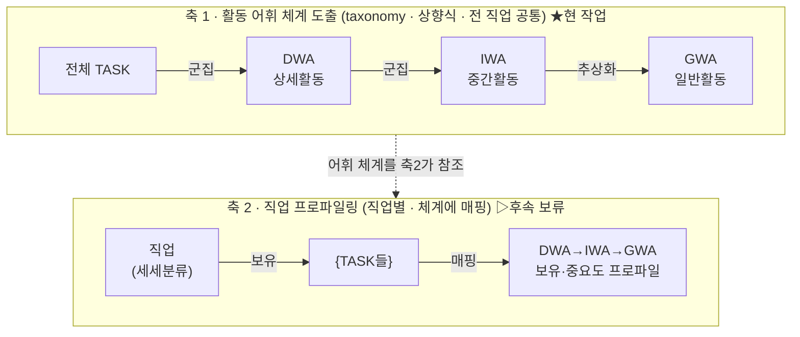
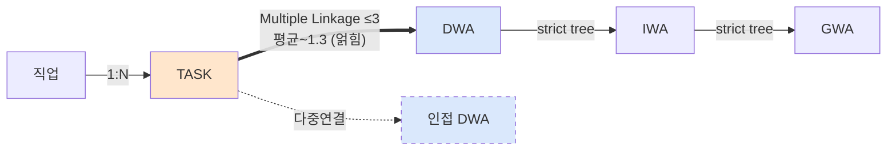
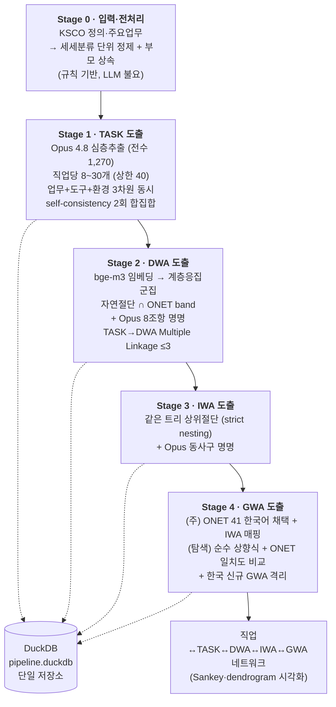
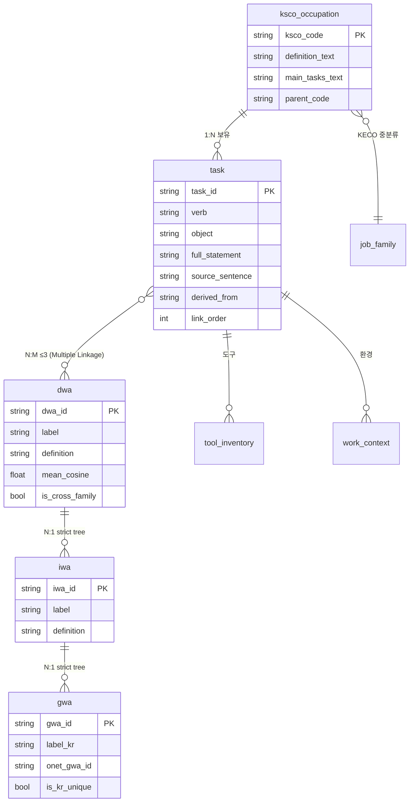
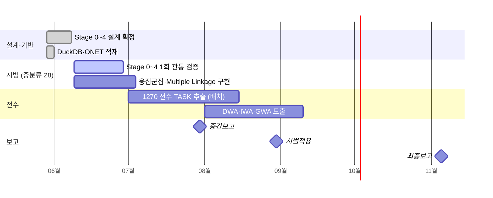

# 직업정보 프레임워크 — 종합 설계 보고서

> **국가데이터처 2026 · 직업분류 고도화를 위한 직업정보 프레임워크 연구**
> 작성일 2026-06-09 · 버전 v1.0 (Stage 0~4 설계 확정 기준 종합)
> 권위 기준: `stages/00_전체구조` + `stages/Stage0~4` + `stages/05_통합설계_검토서`
> 위치: `04_framework_design/docs/15_종합설계_보고서_v1.md`

---

## 0. 한눈에 보는 요약 (Executive Summary)

본 연구는 **한국표준직업분류(KSCO) 8차의 직업설명 텍스트**를 입력으로 받아, 그 안에 잠겨 있는 직무활동을 **TASK → DWA → IWA → GWA의 4계층 작업활동 체계**로 자동 도출하는 NLP 파이프라인을 설계·구현한다. 미국 노동부의 **O\*NET Work Activities Project(2014)** 절차를 1:1로 차용하되, 2014년 당시 불가능했던 "텍스트 의미 이해"를 **최신 LLM(Claude Opus 4.8)**으로 대체하여, 사람 분석가 수십 명이 하던 작업을 단일 노트북에서 재현 가능하게 만든다.

| 항목 | 내용 |
|---|---|
| **입력** | KSCO 8차 해설서 — 세세분류 1,270개의 정의·주요업무·예시 (통계청 고시, 권위 100%) |
| **출력** | 4계층 작업활동 사전(TASK·DWA·IWA·GWA) + 직업↔활동 연결 네트워크 |
| **핵심 방법** | LLM 심층추출 + 의미 임베딩 + 계층적 응집군집 + ONET 하이브리드 매핑 |
| **사용 모델** | Claude Opus 4.8(추출·명명) · BAAI/bge-m3(임베딩) · scipy 계층군집 |
| **저장소** | DuckDB 단일 파일 (`pipeline.duckdb`) — 백업·재현이 파일 복사 한 번 |
| **현 스코프** | **Stage 0~4(어휘 체계 도출)에 집중**. 프로파일링·Responsibility 3축·변별력 분석은 후속(축2) |
| **판정** | 설계 정합성 교차검증 완료 → **구현 착수 가능(Go)** |

---

## 1. 연구의 두 축 — 무엇을 만드는가

본 프로젝트는 **두 개의 다른 일**을 한다. 섞으면 혼란하므로 분리한다.



- **축 1 (현 작업)**: 한국 직업 전체에서 통용되는 **작업활동 "사전"**(공유 어휘)을 상향식으로 만든다. 직업과 무관한 공통 체계.
- **축 2 (후속 보류)**: 각 직업이 그 사전의 어느 활동을, 얼마나(중요도) 수행하는가를 프로파일링. **Responsibility 3축·GWA 중요도·변별력 분석**이 여기 속하며, 본 연구 범위 밖으로 의도적으로 보류한다.

> 핵심: **GWA는 "직업에 붙는 라벨"이 아니라, 직업의 TASK들이 체계를 타고 올라가 형성하는 프로파일**이다.

---

## 2. 최종 구조 = "얽힌 네트워크" (ONET 실측 근거)

ONET 데이터(v29.3)를 직접 분석한 결과, 구조는 **깨끗한 트리가 아니라 부분적으로 얽힌 네트워크**다.

| 관계 | 구조 | 카디널리티 | ONET 실측 근거 |
|---|---|---|---|
| 직업 → TASK | 보유 | 1 : N | 직업당 ~20 TASK |
| **TASK → DWA** | **Multiple Linkage (얽힘)** | **N : M (≤3)** | 18,495 task → 23,233 링크 · **평균 1.26 · 최대 3** (단일 78% / 2개 19% / 3개 3%) |
| DWA → IWA → GWA | **Strict tree** | N:1, N:1 | DWA→IWA 다중매핑 **0건** = 완전 트리 |
| 직업 → GWA | 프로파일 | N : M | 직업당 여러 GWA에 걸침 |



→ **백본(DWA–IWA–GWA)은 단일 트리, TASK는 Multiple Linkage(≤3)로 백본에 엮이고, 직업은 여러 GWA에 걸친다.** 이 두 지점("TASK 다중연결" + "직업 다중 GWA")이 전체를 네트워크로 만든다.

**시각화 산출물(논리 방어용)**: ① dendrogram(백본 트리) ② Sankey/네트워크 다이어그램(직업–TASK–DWA–IWA–GWA 흐름) ③ 직업×GWA 히트맵.

### 4계층 명명 규약 (ONET 실데이터 확인)

| 레벨 | 풀네임 | 형태 | 한국어 규칙 | 예시 |
|---|---|---|---|---|
| **GWA** | Generalized Work Activities | **명사형** | 명사형 일반활동 | "정보 입수" |
| **IWA** | **Intermediate** Work Activities | 동사구·일반 | 여러 DWA 포괄 동사구 | "문서·자료를 읽어 업무에 활용한다" |
| **DWA** | Detailed Work Activities | 동사구·상세 | 구체적 동사구 | "경로 파악을 위해 지도를 읽는다" |
| **TASK** | Task Statement | 동사+목적어 | "~한다" 종결 단일 행동 | "도면을 검토하여 형태를 확인한다" |

> IWA·DWA는 둘 다 동사구이며 **차이는 목적어의 일반성**(DWA 구체 ↔ IWA 포괄). GWA만 명사형.
> ※ 4계층은 영문 약어 **TASK/DWA/IWA/GWA로 통일**(한국어 의역 혼용 금지).

---

## 3. 전체 파이프라인 (End-to-End 확정본)



각 단계는 **①목표 ②도출이론 ③입출력 ④방법 ⑤모델 ⑥소스코드 ⑦검증 ⑧결정**의 8항목 템플릿으로 설계되었다. 아래 4~8장에서 단계별로 상술한다.

---

## 4. Stage 0 — 입력·전처리

> 원칙: **본 단계는 "깨끗하고 단위가 확정된 입력"까지만** 책임진다. 무엇이 TASK인지 판정은 Stage 1.

### 4.1 목표·이론
- **목표**: KSCO 원천(정의·주요업무·예시)을 받아, **도출 단위(세세분류)별로 정제·상속·메타부착된 "추출가능 입력 레코드"**를 생성.
- **GIGO 원칙**: 추출·군집 품질은 입력 품질의 상한을 못 넘는다 → 전처리가 토대.
- **도출 단위 = 세세분류(5자리) + 부모 상속(D0)**: 주요업무는 세분류(4자리)에만 존재(1,270 중 일부) → 자식 세세분류에 부모 주요업무를 상속해야 TASK 재료 확보.
- **단일 진실원천(SSOT)**: 모든 입력은 `pipeline.duckdb`에서 결정론적으로 조회 → 재현성.

### 4.2 입력 → 출력

**입력 (DuckDB 적재 완료)**

| 테이블 | 핵심 필드 | 규모 |
|---|---|---|
| `ksco_occupation` | ksco_code, name, definition_text, main_tasks_text, examples_text, parent_code | 1,765 |
| `main_tasks_items` / `job_examples` | 정규화 항목 | 2,367 / 7,622 |
| `mapping_ksco_keco` | KSCO↔KECO 중분류 | 495 |

**출력 (추출가능 입력 레코드)**
```text
{ ksco_code(5자리), name, parent_code(4자리), parent_name,
  definition_text(정제), examples_text, parent_definition_text, parent_main_tasks_text(정제),
  layer="L0", source="KSCO_HS", source_subject=null,
  low_signal: bool,        # 정의 빈약(이름·영문만)  ─ 정의<50자 또는 ASCII비율>0.45
  has_parent_tasks: bool,  # 부모 주요업무 존재
  valid: bool,             # 추출 가능 여부(자기 정의 또는 부모 주요업무 유효)
  remarks: str }           # 비고 — 예: "부모 주요업무 없음·자기정의 기반"
```

### 4.3 절차 (5단계)
1. **단위 확정**: 세세분류(length=5) 1,270개를 도출 단위로 열거. 부모 = 앞 4자리.
2. **상속 결합**: 부모 세분류의 정의·주요업무를 자식에 연결.
3. **텍스트 정제**: 페이지헤더 노이즈 제거(`대분류 N`, `NNN┃한국표준직업분류`, 정의 앞 5자리 코드헤더), 공백·줄바꿈 정규화, (선택) 동의어 lexicon 치환.
4. **메타·플래그 부착**: layer/source; `low_signal`; `has_parent_tasks`; `valid`.
5. **추출 후보 분리**: 주요업무 글머리(·) 단위로 *후보 진술* 분리까지만. **행동진술 여부 판정은 Stage 1**.

### 4.4 모델·코드
- **대부분 규칙 기반(정규식). LLM 불요.** (선택) Mecab-ko·Kss는 동의어/도구·환경 정규화에 한해, 핵심엔 불필요.

| 파일 | 함수 | 상태 |
|---|---|---|
| `utils/ksco_fetch.py` | `fetch_for_extraction()`, `is_low_signal()`, `parent_code_of()`, `iter_scope()` | **구현됨** |
| `utils/preprocess.py` | `clean_text()`, `normalize_ws()`, `build_record()`, `coverage_report()` | 신규 설계 |

### 4.5 검증·핵심 결정 (확정)

| 지표 | 기준 | 중분류28 표본 |
|---|---|---|
| 추출가능 커버리지 | valid 비율 | 48/51 (94%) |
| 노이즈 잔존 | 페이지헤더 0건 | 검증 루틴 필요 |

- **주요업무 없는 세분류(~106개)의 자식**: 자기 정의로만 추출 + `remarks` 표기. **L1 직업사전 보강은 하지 않음(표시만)**.
- **직업명·소제목 필터**: Stage 1이 행동진술 판정 담당. Stage 0은 글머리 후보 분리 + 페이지노이즈 제거까지.
- **도구·환경**: TASK와 동시 추출(Stage 1). Stage 0에서 분리하지 않음.
- **정제 결과**: on-the-fly(중간테이블 없음, 코드+DB로 재현).

---

## 5. Stage 1 — TASK 도출 (★ 핵심 가동 단계)

> 행동진술(동사+목적어) 판정을 담당. 업무·도구·환경 3차원을 1회 호출로 동시 추출.

### 5.1 목표·정의
- **목표**: 세세분류별 입력에서 **① 직무활동(TASK) ② 사용 도구(Tools) ③ 작업 환경(Work Context)** 3차원을 **동시** 추출.
- **TASK 정의**: "**동사 + 목적어 (+ 수단/맥락)**" 구조의 단일 행동진술. 주된 동사 1개. "~한다/~수행한다" 종결.
  - 예: "도면을 검토하여 형태를 확인한다" → `verb=검토하다, object=도면`.
- **제외**: 직업명·소제목, 너무 일반적 진술("업무를 수행한다"), 예시 나열.

### 5.2 도출 이론
- **직무분석 task inventory**(McCormick 1979) + **ONET task statement 규약**(동사+목적어, 단일 주동사).
- **ONET 2014 정성 기각 → LLM 극복**: ONET은 "당시 NLP가 task 의미 추출 불가"라 자동화를 기각. 2026 LLM 의미이해로 그 전제를 깸 → **LLM hybrid**.
- **Self-consistency**: 동일 입력 2회 독립 실행 → 환각·변동 통제 ("같은 입력 같은 결과" 방어).
- **3차원 동시 추출**: 1회 호출 → 추가비용 0. 단 도구·환경은 **명시 단서만**(근거스팬 필수, 빈값 허용) — KSCO 한계 정직 반영.

### 5.3 입력 → 출력 스키마

**입력**: Stage 0 레코드 — 추출컨텍스트(세세정의 + 조상정의 대>중>소>세 결합) + 상속 적용된 주요업무 + 예시 + 메타.

> ⚠️ **출처 분기 처리** (실측 출처 분포):
> - 주요업무 **보유**(자체 167 / 세분류 상속 1,027) → **2-pass** (주요업무 골격 → 세세정의 특화).
> - 주요업무 **없음(76, 군인 등)** → 추출컨텍스트(세세+조상 정의)만으로 TASK 도출.
> - **빈약 세세정의(low_signal 385)** → 반드시 조상정의를 함께 투입(세세정의 단독 추출 금지).

**출력 3종**
```text
task:           {task_id=T_{code}_{seq}, ksco_code, parent_code, verb, object,
                 full_statement, source_sentence, layer, source, source_subject,
                 confidence, extraction_runs, cross_consistency, low_signal,
                 derived_from}   ← ★ 도출 추적 필드
tool_inventory: {tool_id, ksco_code, name, category(HW/SW/도구/장비/시스템),
                 evidence_span, confidence}
work_context:   {context_id, ksco_code, category(장소/위험/사회적/신체적/시간적),
                 value, evidence_span, confidence}
```

### 5.4 절차 (6단계)
1. **규칙 1차 + 행동진술 판정**: "~다" 종결·동사+목적어 형태만 후보로(직업명·소제목 제외).
2. **Opus 심층추출 (3차원 동시, ONET 준거 8~30·상한 40)**: 시스템 프롬프트로 task·tools·work_context를 JSON 출력.
   - **2-pass 특화**: (Pass1) 상속 주요업무로 활동 골격 → (Pass2) 세세분류 정의·예시로 목적어 구체화·고유활동 추가·무관 제거.
3. **Self-consistency (Opus 2회 독립 실행)**: 동일 입력 2회 → **합집합 채택**(둘 중 하나라도 나온 TASK 포함 = 최대 도출), 둘 다 나온 TASK는 confidence↑. **cross-model 안 함**(Opus 단독).
4. **도구·환경**: 명시 단서 있을 때만, 근거스팬 부착, 없으면 빈 배열.
5. **도출 과정 기록(★ 상세 추적)**: 각 TASK에 `source_sentence`(원문 근거) + `derived_from`(상속 주요업무/세세정의/조상정의 어디서 특화됐는지) → **엑셀만 봐도 "이 TASK가 어디서 어떻게 나왔는지" 추적 가능**.
6. **정규화·중복제거·적재**: 동의어 정규화 → **의미 중복 병합**(bge-m3 코사인 ≥ ~0.9 near-dup 통합, L0 우선) → 적재 + `llm_call_log` 캐시.

### 5.5 사용 모델 (확정)
- **추출 = Claude Opus 4.8 단독**. **구독(Claude MAX)·Claude Code 활용 → API 미사용, GPT 미사용.**
- **전수(1,270) 실행 방식**: Claude Code **서브에이전트 오케스트레이션** — 세세분류를 배치(중분류/소분류 단위)로 나눠 각 서브에이전트(=구독 Opus)가 심층 추출 → JSON 수합 → 적재. (API 키 불필요)
- **개수 기준**: ONET 실측(923직업·18,796 TASK, **중앙값 20·평균 20.4·90%ile 30·최대 40**) 근거 → 직업당 **8~30 목표, 상한 40**.

### 5.6 실제 시스템 프롬프트 (구현본 발췌, 토씨 보존)

````text
당신은 한국표준직업분류(KSCO) 8차 직업설명을 분석하여, 그 직업의
직무활동(Tasks)·사용 도구(Tools)·작업 환경(Work Context)을 **동시에**
추출하는 직무분석 NLP 전문가다. 본 추출은 ONET task statement 규약과
직무분석 task inventory 표준을 따른다.

[추출 단위 — Task]
- Task는 "동사 + 목적어 (+ 수단/맥락)" 구조의 단일 행동 진술. 주된 동사 하나만.
- "~한다 / ~수행한다"로 끝낸다. 복합 행동은 2개 task로 분할.
- 제외: ① 너무 일반적 진술 ② 직업명·소제목 ③ 직업 예시 나열

[개수 기준 — ONET 준거]
- 직업당 TASK 8~30 목표, 상한 40 (ONET 923직업 중앙값 20·90%ile 30·최대 40)
- 8개 미만이면 창작 말고 나온 만큼만. 40 초과는 중복·세분과잉 통합.

[★ 도출 과정 추적 — 필수]
- source_sentence: 그 task의 원문 근거 문장 그대로
- derived_from: "상속 주요업무" / "세세분류 정의" / "조상정의(세분류)" 등

[출력 JSON 스키마 — 반드시 이 형태로만]
{ "ksco_code": "...", "tasks": [{verb, object, full_statement,
  source_sentence, derived_from, confidence}], "tools": [...], "work_context": [...] }

[금지] JSON 외 출력 금지 · 추측·창작 금지 · 영문 번역 금지
````

### 5.7 핵심 공식 — Self-Consistency 합집합 (현행 구현 코드 `TEST1/pipeline/s1_extract.py`)

Opus 서브에이전트가 동일 입력을 **2회 독립 추출** → **합집합(union) 채택**. 두 번 다 나온 TASK는 confidence↑. Jaccard는 **게이트가 아니라 기록용**(`cross_consistency`)으로만 남긴다 — "최대 도출(누락 최소화)"이 목표이기 때문.

$$J(A, B) = \frac{|A \cap B|}{|A \cup B|}, \qquad A,B = \{(\text{verb}, \text{object})\} \quad (\text{기록만})$$

```python
# TEST1/pipeline/s1_extract.py (현행 · 6/9) — Opus 단독·합집합, GPT 없음
CONF_BOTH = 0.95   # 2회 모두 출현
CONF_ONE  = 0.80   # 1회만 출현

def union_runs(outs, code):
    """2회(이상) 합집합. (verb,object)로 dedup, 둘다출현→conf↑, jaccard 기록."""
    sets = [{task_key(t) for t in (o.get("tasks") or [])} for o in outs]
    cross = jaccard(sets[0], sets[1]) if len(sets) >= 2 else 1.0  # 기록만(게이트 아님)
    merged, counts = {}, {}
    for o in outs:
        seen = set()
        for t in o.get("tasks") or []:
            k = task_key(t)
            if k == ("", "") or k in seen:
                continue
            seen.add(k); counts[k] = counts.get(k, 0) + 1
            merged.setdefault(k, t)
    tasks = [{**t, "confidence": CONF_BOTH if counts[k] >= 2 else CONF_ONE,
              "run_votes": counts[k]} for k, t in merged.items()]
    return {"ksco_code": code, "tasks": tasks, ...,
            "extraction_runs": len(outs), "cross_consistency": round(cross, 4)}
```

> ✅ **설계 정합 확인**: 현행 `TEST1`은 **Opus 단독 · 2회 합집합**으로 최신 설계(stages/Stage1)와 일치. GPT cross-check·Jaccard 0.85 게이트는 **구버전 `scripts/utils/consistency.py`(5/30, 폐기)**의 방식이며 현행에서 사용하지 않는다(§13.2 참조).

### 5.8 검증·핵심 결정

| 지표 | 기준 | 현황 |
|---|---|---|
| 직업당 TASK 수 | 8~30 (상한 40) | ONET 실측 준거 |
| self-consistency | 2회 합집합, Jaccard는 기록(`cross_consistency`) | E2E 1.0 ✓ |
| 도구·환경 근거스팬 | 100% 부착 | ✓ |
| 직업명 혼입 | **0건** | ⚠️ 규칙추출서 누출 → 필터 보강 대상 |

- **검증셋**: 회계사(2812)·용접원(7406) E2E 통과. **Stage 1은 현행 `TEST1`에 설계대로 구현·가동(파일럿 중분류 28 완료).**

---

## 6. Stage 2 — DWA 도출 (TASK → 군집 → DWA)

### 6.1 목표·이론
- **목표**: 전수 TASK를 의미 유사도로 **상향식 군집**하여 **DWA(상세 작업활동)**를 도출하고, 각 DWA에 **8조항 정식 이름**을 붙인다.
- **DWA 정의**: 여러 직업·여러 TASK가 공유하는 **중간 추상 수준 활동**. 예: "재무 기록을 조사하여 재무제표를 작성한다"(회계사·세무사·신용분석가 공통).
- **핵심 가치**: 다른 직업의 TASK가 같은 DWA에 묶이면 = Cross-Job → 직업전환·변별력 분석 기초.
- **이론**: ONET WA Project DWA 절차 차용 + **분포가설**(유사 의미 = 임베딩 근접) + **계층적 응집군집**.

### 6.2 절차 (8단계)
1. **임베딩**: 전수 TASK `full_statement` → bge-m3(1024d, L2 정규화).
2. **상향식 계층군집**: 전체 TASK에 평균연결·코사인 `linkage` 1회 → dendrogram(상위 계층과 공유).
3. **DWA 수준 절단(자연 + ONET band)**:
   - 절단높이별 군집수 곡선·안정구간(plateau) 산출.
   - **ONET 비율 broad band** = (전수 TASK수 ÷ 12) ~ (÷ 6) 범위. 이 band 안에서 가장 안정적 절단점 채택.
4. **채택 임계**: 군집크기 **< 4 task 또는 소속 직업 < 3** → DWA 미인정(소형은 병합 또는 검토큐). [ONET 기준]
5. **Multiple Linkage(★ 핵심)**: 각 TASK를 1차 DWA(자기 군집) + 유사도 임계 초과 인접 DWA centroid에 **최대 3개** 연결. 목표 평균 ~1.3(ONET 1.26). **이 다중연결이 strict-tree 백본에 TASK를 엮어 "얽힌 네트워크"를 만든다.**
6. **DWA 명명(★ Opus 8조항)**: 각 군집 대표 TASK 5건을 Opus에 입력 → 8조항 준수 라벨 작성. 군집 다수 → 서브에이전트 배치.
7. **8조항 자동검증**: 위반 시 Opus 재작성(최대 3회).
8. **적재**: dwa / task_to_dwa(트랜잭션) + cross-family 플래그.

### 6.3 DWA Writing Standards 8조항 (한국어판 · ONET 본문 25p 차용)

| # | 조항 |
|---|---|
| 1 | **하나의 주된 행동 동사만** 사용. DWA는 그 동사로 시작. |
| 2 | **현재형·서술형** 어미 통일("한다", "수행한다", "관리한다"). |
| 3 | **명사는 최소한**으로 쓰되 구체적. 여러 객체는 "또는"으로 연결. |
| 4 | **명사 일반화 수준은 Job Family 단위에 맞춤**. 너무 일반("기계")·너무 특수("CT-7 절삭로봇") 모두 금지. 중간("의료 영상 장비") 권장. |
| 5 | 필요 시 형용사로 직업 맥락 명시. |
| 6 | **"예:…", "포함하여…" 예시구 회피**(불가피 시 1개). |
| 7 | **목적절은 활동 의미 식별에 필수일 때만**. 가능하면 동사구로 흡수. |
| 8 | **중학교 2학년 가독성** 수준. 전문 용어는 직업·산업 표준 용어 한정. |

> ⚠️ 8조항 본문의 **권위 명문화는 착수 전 필수**(코드 `dwa_rules.py`와 1:1 대응). 본 표가 그 기준이다.

### 6.4 핵심 공식 — 임베딩·near-dup 병합 (현행 구현 코드)

**임베딩 (bge-m3 dense, 1024d)** — 현행 `TEST1/pipeline/dedup.py`
```python
# TEST1/pipeline/dedup.py (현행 · 6/8) — FlagEmbedding 직접 사용
NEAR_DUP_COS = 0.90
def bge_m3_embed(texts):
    model = BGEM3FlagModel("BAAI/bge-m3", use_fp16=True)
    return model.encode(texts, batch_size=12, max_length=256)["dense_vecs"]
```

**TASK 단계 의미중복 병합 (코사인 ≥ 0.90, union-find)** — 합집합이 만든 의역중복을 Stage 2 군집 오염 전에 선행 통합(설계 §4-6 C3):
```python
def merge_near_dup(items, text_key, threshold=0.90, ...):
    sim = _cosine_matrix(embed(texts))          # L2 정규화 후 u @ u.T
    parent = list(range(n))                      # union-find
    for i in range(n):
        for j in range(i + 1, n):
            if float(sim[i][j]) >= threshold:    # 0.90 이상 = 같은 활동
                union(i, j)
    # 대표 = confidence 최고(동률 시 먼저 등장) 보존, 나머지 병합 로그
```

**군집 내 평균 코사인 응집도** (Stage 2 게이트 ≥ 0.70):

$$\bar{c} = \frac{1}{n(n-1)} \left( \sum_{i}\sum_{j} \mathbf{e}_i \cdot \mathbf{e}_j - n \right)$$

> ⚠️ **Stage 2 군집 코드는 아직 미구현**: 현행 `TEST1`은 Stage 0~1 + dedup까지만 가동. **계층적 응집군집(평균/Ward·코사인)** 함수(`agglomerative_levels`, `natural_cut_in_band`)는 **신규 구현 대상**이다.
> ※ 구버전 `scripts/utils/clustering.py`(5/30, 폐기)에 HDBSCAN이 있으나 **이는 채택 안 함** — HDBSCAN은 노이즈(-1) 38~62% 미배치로 직업 프로파일에 구멍을 내고 재현성·nesting을 깨므로 설계에서 부적합 판정(§00 비교표). 현행 군집은 응집군집으로 새로 짠다.

### 6.5 검증·핵심 결정

| 지표 | 기준 |
|---|---|
| DWA 수 | 전수 TASK ÷ 6~12 (ONET TASK:DWA≈9:1) |
| 군집 응집도 | 평균 코사인 ≥ 0.70 |
| 8조항 준수율 | ≥ 0.90 |
| Cross-Family 비율 | 10~20% (ONET≈12%) |

- **군집 = 계층적 응집군집**. 스케일 시 **2단계 하이브리드**(미니배치 k-means→centroid 응집).
- **Multiple Linkage ≤3 부활**(이전 "1:1" 폐기). `task_to_dwa.link_order ∈ {1,2,3}`.

---

## 7. Stage 3 — IWA 도출 (DWA → 상위 절단)

### 7.1 목표·이론
- **목표**: DWA를 한 단계 더 일반화하여 **IWA(중간 작업활동)** 도출 + 정식 명명.
- **IWA 정의**: 여러 DWA를 포괄하는 중간 추상 수준. 예: {재무제표를 분석한다 + 투자 위험을 평가한다 + 신용도를 산정한다} → IWA "재무·투자 정보를 분석하여 평가한다".
- **이론**: ONET 3계층(DWA 2,087 → IWA 332 → GWA 41). **단일 dendrogram 상위 절단** → DWA ⊂ IWA nesting **자동 보장**.

### 7.2 절차
1. **DWA 대표벡터**: 각 DWA의 medoid(또는 소속 TASK 임베딩 평균, 정규화).
2. **상향식 군집(방법 A 채택)**: Stage 2와 *같은* TASK dendrogram에서 **더 높은 높이로 절단** → IWA. **DWA⊂IWA nesting 수학적 보장**(방법 B = DWA 벡터 재군집 후 사후매핑은 기각).
3. **IWA 수준 절단**: DWA:IWA ≈ 6:1 band 내 자연 plateau. 없으면 band 중앙(명시).
4. **IWA 명명(Opus, 동사구·일반)**: 소속 DWA 라벨 5개 → 목적어를 한 단계 일반화한 동사구. 서브에이전트 배치.
5. **8조항 자동검증** → 위반 시 재작성(≤3).
6. **적재**: iwa / dwa_to_iwa(1:1 nesting).

### 7.3 검증·핵심 결정

| 지표 | 기준 |
|---|---|
| IWA 수 | DWA ÷ 5~8 (ONET 6.3:1) |
| nesting 일관성 | 모든 DWA가 정확히 1 IWA에 속함(단일 트리) |
| IWA 응집도 | **보고 지표(게이트 아님)**, 참고치 ~0.55 |

- **절단 방식 = A(같은 트리 상위절단)** — strict nesting 수학 보장(ONET DWA→IWA 다중매핑 0건과 일치).
- **IWA 응집도 = 보고 지표**(게이트 아님). ONET도 수치기준 없음(분석가 판단·트리 구조).
- **빈 계층 허용**: DWA 적은 영역은 IWA=DWA로 수렴 가능(자연 결과).

---

## 8. Stage 4 — GWA 도출 (두 트랙 동시)

### 8.1 목표 — 두 트랙
- **(주) 하이브리드 = ONET이 실제로 한 방식**: ONET 41 GWA(한국어)를 **상위 어휘로 채택**, 각 IWA를 가장 맞는 GWA에 **매핑** → 정보분석/정신과정/업무수행 등 **ONET 형태 GWA 보장**.
- **(탐색) 순수 상향식 = 가설 검증**: 같은 dendrogram 최상위 절단으로 **한국형 GWA 자생 도출** → ONET과 **몇 % 일치하는가** 비교(학술 기여).
- **GWA 정의**: 직업·산업 무관 가장 일반적 활동 범주. ONET 41개(4영역). **명사형**.

### 8.2 이론 (왜 하이브리드가 주인가)
- **ONET 사실**: GWA는 데이터 군집이 아니라 **전문가 설계 Content Model 분류체계**(PAQ·직무분석 이론). 순수 상향식으로 41 재현은 어렵다(실측 자연군집 ~5).
- **하이브리드 = ONET 정석**: GWA top-down 선재 + IWA를 매핑 → ONET 형태를 얻는 정석.
- **순수 상향식 = 반증 가능한 가설 검증**: 발산해도 "한국 직업구조 고유성"으로 연구 정보.

### 8.3 절차

**트랙 1 — 하이브리드(주)**
1. **ONET 41 GWA 한국어화**: Opus로 1회 일괄 번역(캐시) → `gwa.label_kr`.
2. **IWA → GWA 매핑**: 각 IWA 대표벡터 ↔ ONET 41 GWA(한국어) 임베딩 **최근접**. cosine 기록. 애매건(임계 미만)은 Opus zero-shot 택1 — **임베딩+LLM 2중**.
3. **한국 신규 GWA 격리**: 최근접 cosine < 0.55 이고 ONET 41에 없으면 `is_kr_unique=true`.
4. **적재**: gwa / iwa_to_gwa.

**트랙 2 — 순수 상향식(탐색)**
5. **최상위 절단**: 같은 dendrogram을 더 높이 절단 → 한국형 GWA 자생(개수 강제 없음).
6. **ONET 비교**: 한국형 GWA 중심벡터 ↔ ONET 41 최근접 → 일치 GWA 수 / 평균 유사도.
7. **보고**: "KSCO 자생 GWA n개, ONET 41 중 m개와 매칭(평균 cos)".

### 8.4 GWA 4대 영역 (보고 가독성)
정보입력 · 정신과정 · 작업산출 · 타인과 상호작용

### 8.5 검증·핵심 결정

| 지표 | 기준 |
|---|---|
| (주) IWA→GWA 매핑 신뢰 | 임베딩+LLM 일치율 ≥ 0.80, 애매건 Opus 재판정 |
| 한국 신규 GWA | cosine < 0.55 격리, 비율 보고 |
| (탐색) ONET 일치 | 매칭 수·평균 cos 보고(가설) |

- **하이브리드 매핑 = 임베딩 최근접 + 애매건 Opus zero-shot 2중**. 구독이라 요금 0.
- **한국 신규 GWA 허용**(cos<0.55 격리).
- **탐색 트랙 = 자연절단 그대로 + ONET 비교**(개수 강제 없음).

---

## 9. 핵심 모델·공식·도구 총정리

### 9.1 사용 모델·도구 스택

| 단계 | 도구/모델 | 파라미터·근거 |
|---|---|---|
| **추출·명명** | **Claude Opus 4.8 단독** | 구독(Claude MAX)·서브에이전트, API/GPT 없음. seed 미사용(구독). 최상위 의미이해 |
| **임베딩** | **BAAI/bge-m3** | 1024차원, 다국어, L2 정규화 → 코사인=내적. 한국어 TASK↔영어 ONET 교차비교 |
| **군집** | **scipy 계층적 응집군집** | 평균연결(average)/Ward · 코사인거리 · 단일 트리(dendrogram) → nesting 보장 |
| **절단** | 안정구간(plateau) 분석 ∩ ONET band | 비순환 granularity(목표값 강제 없음) |
| **8조항 검증** | 규칙(형태소·정규식) | 어미·명사수·금지일반어·예시구·목적절·길이 |
| **저장·재현** | **DuckDB** + 캐시 + `llm_call_log` | 단일 파일 = 백업·이관·재현 |
| **오케스트레이션** | Claude Code 서브에이전트 / typer CLI(`kfw`) | 배치 누적 진행 |

### 9.2 핵심 공식 모음

| 공식 | 식 | 용도·임계 |
|---|---|---|
| **Jaccard 일치율** | $J(A,B)=\dfrac{\lvert A\cap B\rvert}{\lvert A\cup B\rvert}$, $A,B=\{(verb,object)\}$ | self-consistency **기록용**(게이트 아님), 채택은 합집합 |
| **near-dup 코사인** | $\cos(\mathbf{e}_i,\mathbf{e}_j)\ge 0.90$ → union-find 병합 | TASK 의역중복 통합(Stage2 오염 방지) |
| **코사인 유사도** | $\cos(\mathbf{e}_i,\mathbf{e}_j)=\mathbf{e}_i\cdot\mathbf{e}_j$ (L2 정규화 시) | 임베딩 근접도 |
| **군집 평균 응집도** | $\bar{c}=\dfrac{1}{n(n-1)}\left(\sum_i\sum_j \mathbf{e}_i\cdot\mathbf{e}_j-n\right)$ | DWA 군집, ≥ 0.70 |
| **DWA band** | TASK수 ÷ 12 ~ ÷ 6 (ONET 9:1) | DWA 절단 범위 |
| **IWA band** | DWA수 ÷ 5 ~ ÷ 8 (ONET 6.3:1) | IWA 절단 범위 |
| **Multiple Linkage** | TASK당 ≤ 3 DWA, 목표 평균 ~1.3 | ONET 실측 1.26 |
| **Responsibility 일관성**(후속) | 점수차 합 =0→1.0 / ≤2→0.85 / >2→0.65 | 축2(보류) |

### 9.3 신뢰도(confidence) 부여 규칙

| 상황 | confidence |
|---|---|
| 2회 모두 출현(`CONF_BOTH`) | 0.95 |
| 1회만 출현(`CONF_ONE`) | 0.80 |
| low_signal 약신호 특화 | 하향 조정 |

---

## 10. 데이터 모델 (DuckDB 스키마)



| 테이블 | 키 | 핵심 필드 |
|---|---|---|
| `ksco_occupation` | ksco_code | 명칭, 정의 원문, 주요업무, parent_code, job_family_id |
| `task` | task_id | verb, object, full_statement, layer, source, **source_sentence, derived_from**, primary_gwa_id |
| `dwa` | dwa_id | label(8조항), definition, cluster_size, n_jobs, mean_cosine, is_cross_family |
| `iwa` | iwa_id | label(동사구), definition, n_dwa, mean_cosine |
| `gwa` | gwa_id | label_kr, onet_gwa_id, onet_label_en, **is_kr_unique**, source |
| `task_to_dwa` | (task_id, dwa_id) | **link_order ∈ {1,2,3}** (Multiple Linkage) |
| `dwa_to_iwa` / `iwa_to_gwa` | 연결표 | 1:1 nesting |
| `tool_inventory` / `work_context` | id | category, evidence_span, confidence |
| `llm_call_log` | call_id | model, prompt_hash, 결과 캐시(재현용) |

> DuckDB 단일 파일(`pipeline.duckdb`)에 통합 — 백업·이관·전수 재현이 파일 복사 한 번.

---

## 11. 핵심 결정 레지스트리 (전 단계 한눈)

| 항목 | 확정 | 출처 |
|---|---|---|
| 도출 단위 | 세세분류(5자리) + 부모 세분류 주요업무 상속 | S0/S1 |
| 주요업무 없는 직업 | 자기 정의로만 + `remarks`(L1 보강 안 함) | S0 |
| TASK 추출 모델 | **Opus 4.8 단독**(구독·서브에이전트, API/GPT 없음) | S1 |
| TASK 개수 | 직업당 **8~30, 상한 40** | S1 |
| TASK 3차원 | 업무+도구+환경 동시(명시단서·근거스팬·빈값허용) | S1 |
| self-consistency | Opus **2회 합집합**(GPT cross 폐기·휴면) | S1 |
| 행동진술 필터 | "~다 종결 + 동사 형태소"(직업명 제외) | S1 |
| 군집 방법 | **계층적 응집군집**(평균/Ward·코사인), 스케일시 2단계 하이브리드 | 00/S2 |
| DWA 절단 | 자연 plateau ∩ ONET band(TASK÷6~12) | S2 |
| TASK→DWA | **Multiple Linkage ≤3**(네트워크) | S2 |
| DWA 명명 | Opus **8조항** 정식 라벨 | S2 |
| 백본 구조 | **strict tree**(같은 트리 상위절단, 사후매핑 불필요) | 00/S3 |
| IWA 응집도 | **보고 지표(게이트 아님)** ~0.55 | S3 |
| IWA·DWA 명명형 | **동사구**(IWA 일반/DWA 상세) | 00/S3 |
| GWA(주) | **ONET 41 한국어 채택** + IWA 임베딩+Opus 2중 매핑 | S4 |
| GWA(탐색) | 순수 상향식 자연절단 → ONET 일치도 비교 | S4 |
| 한국 신규 GWA | 허용(cos<0.55 격리, `is_kr_unique`) | S4 |
| GWA 명명형 | 명사형 + 4대 영역 표기 | S4 |

---

## 12. 이론적 근거·타당성 (학회·통계청 방어 논리)

### 12.1 단계별 이론

| 단계 | 이론 | 출처 |
|---|---|---|
| ① TASK 추출 | 직무분석 task inventory 전통 | McCormick (1979); ONET task statement 규약 |
| ② 임베딩 | **분포가설**("유사 맥락 = 유사 의미") | Harris (1954); Firth (1957); BGE-M3 (Chen 2024) |
| ③ 계층군집 | 계층적 응집군집 + ONET WA 절차 | — |
| ④ 절단 | 군집수 결정·안정성 기반 모델선택 | Milligan & Cooper (1985); Ben-Hur et al. (2002) |
| ⑤ ONET 비교 | **구성타당도(수렴타당도)** | Cronbach & Meehl (1955) |
| 설명가능성 | Concept Bottleneck Models — 4계층 = concept hierarchy | Koh et al. (2020) |

### 12.2 방법이 목적에 타당한 이유
1. **재현가능성**: 임베딩·군집·절단이 결정론적 → 통계청 "같은 입력 같은 결과" 충족.
2. **설명가능성(CBM)**: TASK→DWA→IWA→GWA를 역추적 → "왜 이 분류인가"에 답함.
3. **국제정합성**: ONET 절차 차용 + ONET 비교로 ISCO-28 SLF 연계 근거.
4. **변별력**: 같은 KSCO 코드 내 직업이 다른 DWA로 갈리면 세세분류 분기 근거(후속).

### 12.3 ★ 정직한 한계 (실증으로 드러난 타당성 위협)

| # | 위협 | 실증 근거 | 보완책 |
|---|---|---|---|
| 1 | 규칙추출 TASK가 일반적("분석한다/작성한다") → 변별 약화 | 전수 규칙추출 | **LLM 추출로 직업별 특화**(시범 28 검증, 전수 배치) |
| 2 | 교차언어 비교 손실(한국어↔영어 ONET) | 유사도 0.58~0.62 | ONET 41 GWA **한국어 번역** 후 비교 |
| 3 | 수렴 약함(한국형 GWA가 ONET에 부분만 매칭 4~18/41) | 실증 | LLM·한국어 비교 후 재측정; 발산 시 "한국 고유성" |
| 4 | **자연 granularity 부재**(안정구간 폭 ≤0.017, 자연 GWA≈5) | 자연절단 분석 | granularity를 "자연 사실"이 아닌 **"선택된 추상수준"**으로 정의하고 ONET으로 검증 |

> **가설에 대한 현재 결론(정직)**: "ONET 41이 자연 emergent"는 현 방법으론 **미지지**(자연 granularity ~5). 더 방어 가능한 재정식화 →
> **"KSCO 활동을 ONET 절차로 다층화할 수 있고, ONET 41 수준에서 자르면 한국형 GWA가 ONET과 부분 수렴(0.62)한다. 수렴도는 LLM 추출·한국어 비교로 향상 가능하다."**

---

## 13. 구현 현황 & 리스크

### 13.1 ★ 두 코드베이스 — 현행(TEST1)과 폐기(scripts)

본 연구에는 코드 폴더가 **두 개** 있으며 혼동하면 안 된다.

| 폴더 | 시기 | 위상 | 특징 |
|---|---|---|---|
| **`03_NLP_analysis/TEST1/`** | **6/8~9** | **★ 현행(가동 중)** | stages 설계 정합 — **Opus 단독·2회 합집합·bge-m3 near-dup**. Stage 0~1+dedup 구현, 파일럿 28 완료 |
| `03_NLP_analysis/scripts/` | 5/30~31 | 폐기(탐색용) | 옛 방식 — HDBSCAN·GPT cross-check. **현행에서 사용 안 함**(설계가 이미 폐기 결정) |

> 즉 "구현이 구식"이 아니라, **현행 구현(TEST1)은 설계대로**이고, 옛 탐색 코드(scripts)가 따로 남아있을 뿐이다. Stage 2~4는 **아직 어느 폴더에도 현행 구현이 없다**(신규 작성 대상).

### 13.2 구현 현황 (현행 `TEST1` 기준 · built vs to-build)

| 단계 | 구현됨 (TEST1, 설계 정합) | 신규 작성 필요 |
|---|---|---|
| **S0** | `s0_preprocess`(상속·정제·플래그·`build_record`)·`parse_ksco` 적재 | coverage 리포트 보강 |
| **S1** | `s1_extract`(2회 합집합·Opus 서브에이전트)·`dedup`(near-dup)·`s1_persist`·프롬프트·E2E | 규칙 1차 행동진술 필터 보강 · 전수 배치 오케스트레이션 |
| **S2** | — (`db.py`에 DWA·Multiple Linkage 스키마만 준비) | **계층적 응집군집 · 절단(band) · `dwa_rules`(8조항) · DWA 명명** |
| **S3** | — | 같은 트리 상위절단 · IWA 명명 |
| **S4** | ONET 41/IWA332/DWA2087 적재 | ONET 한국어 번역 · IWA→GWA 매핑 · 한국 신규 격리 |
| 공통 | DuckDB DDL · `task_to_dwa.link_order` 스키마 · 엑셀 export | 시각화(Sankey/dendrogram/히트맵) |

> ※ 8조항 본문은 본 보고서 §6.3에 권위 명문화 → 향후 `dwa_rules.py`와 1:1 대응.

### 13.3 리스크·보류

| 항목 | 성격 | 대응 |
|---|---|---|
| 전수 추출 규모(1,270 × 8~30) | 시간·구독사용량 큼 | 서브에이전트 배치 누적 진행 |
| 한국어 임베딩(bge-m3 vs 특화) | 군집 품질 변수 | 시범서 벤치(옵션) |
| GWA 탐색 자연절단 ~5 | 가설 부분지지 | 정직 보고 + ONET 하이브리드가 주 |
| Responsibility 3축·변별력 | **범위 밖(축2)** | 후속 Stage 5~7 |
| 라벨 품질(8조항) | Opus 명명 의존 | 8조항 자동검증·재작성(≤3) |

---

## 14. 실행 로드맵



**권장 다음 단계 (통합검토서 Go 판정)**: 시범 1개 중분류(**28 경영·금융**)로 Stage 0~4 전 과정을 설계대로 **1회 관통**(추적가능·소량) → 설계 현실성·산출물 형태 확인 → 전수 확대.

---

## 부록 A. 산출물 목록

| 코드 | 산출물 |
|---|---|
| ⓐ | KSCO 직업별 4계층 직무기술 정의서 (xlsx/md) |
| ⓑ | 한국형 GWA/IWA/DWA 사전 |
| ⓒ | KSCO ↔ ONET GWA 매핑표 (ISCO-28 SLF 연계) |
| ⓓ | Cross-Job-Family DWA 표 (직업 전환 가능성 분석 기초) |
| ⓔ | 직업–TASK–DWA–IWA–GWA 네트워크 시각화 (Sankey·dendrogram·히트맵) |
| ⓕ | 시범적용 보고서 + 방법론 타당성 보고서 |

## 부록 B. 권위 문서 관계

- **`stages/00~Stage4` + `stages/05_통합설계_검토서`** = **현 최신·권위 설계**(상향식·네트워크·하이브리드 GWA).
- `00_프레임워크_종합설계서_v1.4` = 상위 마스터(일부 항목 stages/가 대체).
- `10_파이프라인_사양서`·`12_도출방법론_설계서` = **부분 구식**(GWA top-down 버킷·HDBSCAN·GPT cross 포함 — 폐기 결정).
- `13_실행과정`·`14_방법론타당성` = 실행기록·이론근거(유효).
- **본 문서(15)** = 위 전체를 종합한 단일 참조 보고서.

---

*v1.0 — 2026-06-09. Stage 0~4 설계 확정 기준 종합. 다음 갱신은 시범(중분류 28) 1회 관통 결과 반영 후 v1.1.*
