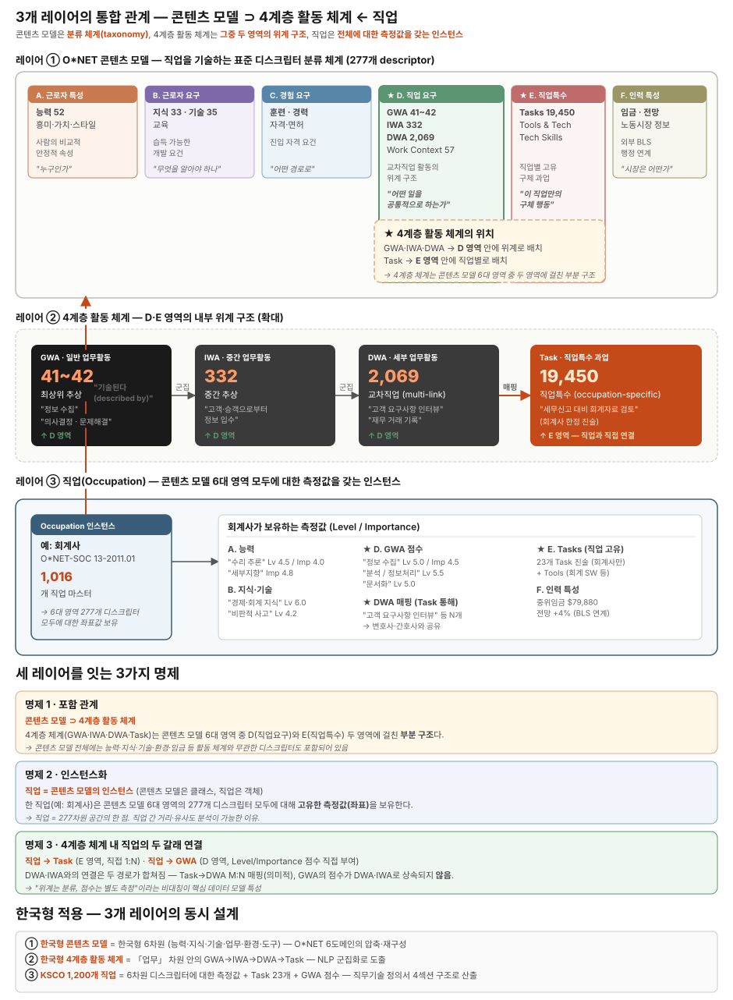

# O*NET 체계 종합 분석 — 한국 직업분류 개편 방안

| 항목 | 내용 |
|---|---|
| 작성 맥락 | P2026-010 국가데이터처 직업정보 프레임워크 연구 / 제안발표 준비 |
| 검증 기준일 | 2026-05-04 |
| 핵심 1차 출처 | onetcenter.org · onetonline.org · bls.gov/soc · 통계청 고시 제2024-328호 · 고용노동부 고시 제2024-63호 |
| 위상 | 본 프로젝트 심층분석의 종합 정리본 — 발표·보고서 작성 시 기본 참조 문서 |

---

## 목차

1. [서론 — 본 연구 목적과 직업정보 프레임워크의 의의](#1-서론--본-연구-목적과-직업정보-프레임워크의-의의)
2. [O*NET-SOC 직업 분류 체계](#2-onet-soc-직업-분류-체계-5계층)
3. [콘텐츠 모델 — 직업을 기술하는 표준 분류 체계](#3-콘텐츠-모델--직업을-기술하는-표준-분류-체계)
4. [4계층 활동 체계 — GWA · IWA · DWA · Task](#4-4계층-활동-체계--gwa--iwa--dwa--task)
5. [측정 척도 — Level과 Importance](#5-측정-척도--level과-importance)
6. [직업과 콘텐츠 모델의 결합 방식](#6-직업과-콘텐츠-모델의-결합-방식)
7. [O*NET 운영 절차 — 2단계 파이프라인](#7-onet-운영-절차--2단계-파이프라인)
8. [미국 SOC ↔ O*NET-SOC 양방향 관계](#8-미국-soc--onet-soc-양방향-관계)
9. [한국 직업분류 현황](#9-한국-직업분류-현황)
10. [직업분류 고도화 옵션 — 본 연구 목적 관점에서 재구성](#10-직업분류-고도화-옵션--본-연구-목적-관점에서-재구성)
11. [본 연구 단계적 로드맵](#11-본-연구-단계적-로드맵)
12. [이전 분석 과정에서 발견된 정정 사항](#12-이전-분석-과정에서-발견된-정정-사항)
13. [참고문헌](#13-참고문헌-종합)

---

## 1. 서론 — 본 연구 목적과 직업정보 프레임워크의 의의

### 1.1 본 연구의 목적과 분석 방향

본 연구의 정식 과제명은 **"직업분류 고도화를 위한 직업정보 프레임워크 연구"** 이다. 이 명칭에서 직업정보 프레임워크는 *수단*이고 직업분류의 개정·고도화가 *목적*임을 분명히 할 필요가 있다. 미국 O*NET은 이 *수단*의 가장 성숙한 사례로, 1991년부터 30년 이상 운영되며 SOC 표준직업분류 개정의 데이터 인프라 역할을 동시에 수행해 왔다.

따라서 본 분석은 두 층위에서 진행된다 — ① O*NET 시스템 자체의 구조와 운영 방식, ② 그 운영이 어떻게 SOC 분류의 개정·고도화에 기여하는지. 한국 적용 방안은 후자에 초점을 맞춰 도출된다.

#### Peterson 외(2001)가 제시한 O*NET의 3대 설계 원칙

- **Multiple Windows (다중 관점)** — 사람·직무·환경·시장을 다축으로 동시 기술
- **Common Language (공통 언어)** — 모든 직업에 동일 디스크립터 적용 → 직업 간 직접 비교
- **Hierarchical Taxonomies (위계적 분류)** — 분석 목적별 추상도 선택 가능

> 출처: Peterson, N. G. et al. (2001). *Understanding Work Using O*NET*. Personnel Psychology, 54(2), 451-492.

### 1.2 직업정보 프레임워크의 개념

직업정보 프레임워크(occupational information framework)는 각 직업의 수행 활동, 요구 역량, 직무 특성 등을 체계적으로 설명하기 위한 정보 구조를 의미한다. 직업정보 프레임워크는 직업의 내용을 구성하는 다양한 요소를 구조화하여 직업 간 비교와 분석을 가능하게 하는 역할을 한다.

일반적으로 직업정보 프레임워크는 다음과 같은 요소로 구성된다.

- 직무 과업 (tasks)
- 업무활동 (work activities)
- 요구 기술 (skills)
- 요구 지식 (knowledge)
- 업무 환경 (work context)

대표적인 사례로는 미국 노동부가 구축한 O*NET 직업정보 시스템이 있으며, O*NET에서는 직업정보를 업무활동, 기술, 지식, 능력 등 다양한 요소로 구조화하여 직업 간 관계를 분석할 수 있도록 하고 있다.

이와 같은 직업정보 프레임워크는 직업의 수행 활동과 요구 역량을 체계적으로 설명함으로써 직업분류 체계의 분석 기반을 제공하는 중요한 역할을 한다.

### 1.3 한국표준직업분류에서 직업정보의 한계

한국표준직업분류는 직업 간 구조적 관계를 체계적으로 제시하는 분류 체계라는 점에서 중요한 역할을 수행하고 있으나, 직업정보 측면에서는 몇 가지 한계를 가진다.

**첫째, 직업의 수행 활동이 서술형 문장 형태로 제시되어 있어 직무 구조 분석에 활용하기 어렵다.** 한국표준직업분류에서는 각 직업의 주요 업무를 문장 형태로 설명하고 있으나, 이러한 설명은 직무활동 단위로 구조화되어 있지 않아 직업 간 비교 분석에 활용하기에는 한계가 있다.

**둘째, 직무활동의 표준화된 분류 체계가 부족하다.** 동일한 업무활동이 서로 다른 표현으로 기술되는 경우가 많아 직업 간 업무활동의 유사성을 체계적으로 분석하기 어렵다.

**셋째, 직업정보가 데이터 구조 형태로 구축되어 있지 않다.** 현재의 직업 설명은 문장 형태로 제시되어 있어 직업정보 데이터베이스 구축이나 직업 분석 연구에 활용하기에는 제한적인 측면이 있다.

이러한 한계는 직업 간 업무활동 구조를 분석하고 직업분류 체계를 고도화하는 데 있어 제약 요인으로 작용할 수 있다.

### 1.4 직업정보 프레임워크 개선과 직업분류 개정의 관계

직업분류 체계는 노동시장 변화와 산업구조 변화에 대응하기 위하여 지속적으로 개정될 필요가 있다. 특히 최근에는 기술혁신, 디지털 전환, 새로운 산업의 등장 등으로 인해 직업 구조가 빠르게 변화하고 있으며, 이러한 변화는 직업분류 체계의 고도화를 요구하고 있다.

직업분류 개정 과정에서 중요한 분석 기반으로 활용되는 것이 바로 직업정보 프레임워크이다. 직업정보 프레임워크는 직업의 수행 활동과 요구 역량을 체계적으로 구조화함으로써 직업 간 유사성과 차이를 분석할 수 있는 기준을 제공한다.

예를 들어 직업 간 업무활동을 비교 분석하면 다음과 같은 분석이 가능하다.

- 직업 간 업무활동 유사성 분석
- 신규 직업의 기능적 위치 파악
- 직업군 재구성 가능성 검토
- 직업 경계 조정

이러한 분석 결과는 직업분류 체계를 개정하거나 새로운 직업을 분류하는 과정에서 중요한 기초 자료로 활용된다.

국제적으로도 직업분류 개정 과정에서는 직업정보 프레임워크가 중요한 역할을 수행하고 있다. 예를 들어 미국의 O*NET 시스템은 직업의 업무활동과 요구 역량을 체계적으로 분석하여 직업 간 관계를 파악하는 데 활용되며, 이러한 정보는 미국 표준직업분류(SOC) 개정 과정에서 중요한 분석 기반으로 활용된다.

따라서 직업정보 프레임워크의 개선은 단순히 직업정보를 확충하는 차원을 넘어 직업분류 체계의 고도화를 위한 핵심 기반으로 작용한다. 직업정보를 업무활동 중심으로 구조화하고 표준화된 직무요소를 구축함으로써 직업 간 관계를 보다 체계적으로 분석할 수 있으며, 이는 향후 직업분류 개정과 직업 구조 분석에 중요한 기반을 제공할 수 있다.

> 출처: 본 연구 제안서 (P2026-010, 2026)

---

## 2. O*NET-SOC 직업 분류 체계 (5계층)

| 수준 | 항목 수 | 코드 자리수 | 예시 |
|---|---|---|---|
| Major Group (대분류) | 23 | 2자리 | 13- Business and Financial |
| Minor Group (소분류) | 98 | 3자리 | 13-2 Financial Specialists |
| Broad Occupation (광범위) | 459 | 5자리 | 13-201 Accountants and Auditors |
| Detailed Occupation (SOC) | 867 | 6자리 | 13-2011 |
| **O*NET-SOC** | **1,016** | **8자리** | **13-2011.00 / .01 / .02** |

### 핵심 사실

- 1,016개 중 **923개**가 O*NET data-level 직업 (실제 측정값 보유)
- 첫 6자리는 SOC와 동일, 뒤 `.XX`가 O*NET 자체 세분
- 2019년에 SOC 2018 기반으로 갱신 완료 (2020.11)
- 최신 데이터베이스: O*NET 30.2 (2026.2.24 릴리즈)

> 출처: [O*NET-SOC Taxonomy](https://www.onetcenter.org/taxonomy.html) · [Updating O*NET-SOC Taxonomy 2019](https://www.onetcenter.org/dl_files/Taxonomy2019_Summary.pdf)

---

## 3. 콘텐츠 모델 — 직업을 기술하는 표준 분류 체계

콘텐츠 모델은 직업을 기술하기 위한 **표준 분류 체계**(클래스)이며, 각 직업은 이 모델 위의 **인스턴스**로서 측정값을 보유한다. 직업마다 콘텐츠 모델이 따로 있는 것이 아니라, 하나의 표준 모델 위에 1,016개 직업이 각자의 좌표값을 채워 넣는 구조다.

### 3.1 6대 도메인 구성

| # | 도메인 | 주요 디스크립터 | 성격 |
|---|---|---|---|
| 1 | Worker Characteristics | Abilities (52) · Interests (RIASEC 6) · Work Values (6) · Work Styles (16) | 사람의 안정적 속성 |
| 2 | Worker Requirements | Skills (Basic 10 + Cross-Functional 25 = 35) · Knowledge (33) · Education | 개발 가능 요건 |
| 3 | Experience Requirements | Experience & Training · Licensing · Job Zones | 진입 자격 |
| 4 | **Occupational Requirements** ★ | **GWA (41) · IWA (325) · DWA (2,000+) · Work Context (57)** | 교차직업 활동 위계 |
| 5 | **Occupation-Specific Information** ★ | **Tasks (19,000+) · Tools and Technology · Tech Skills** | 직업별 고유 행동 |
| 6 | Workforce Characteristics | Labor Market Info · Wages · Outlook | 외부 BLS 연계 |

총 **277개 디스크립터**가 콘텐츠 모델에 등재되어 있으며, 그 중 실제 측정에 사용되는 디스크립터는 239개로 400개 척도가 적용된다.

### 3.2 핵심 인사이트

**4계층 활동 체계는 콘텐츠 모델의 부분 구조이다.** GWA·IWA·DWA는 도메인 4 안에, Task는 도메인 5 안에 위치한다. 능력·지식·기술·임금 등 다른 도메인의 디스크립터는 4계층 체계와 무관하다.

> 출처: [The O*NET Content Model](https://www.onetcenter.org/content.html) · [O*NET Data Collection Overview](https://www.onetcenter.org/dataCollection.html)

---

## 4. 4계층 활동 체계 — GWA · IWA · DWA · Task

### 4.1 정의와 개수

| 계층 | 개수 | 정의 | 도메인 | 측정값 |
|---|---|---|---|---|
| **GWA** (Generalized Work Activities) | **41** | 모든 직업에 공통적인 최상위 추상 활동 | 4 | ✓ Level + Importance |
| **IWA** (Intermediate Work Activities) | **325** | GWA와 DWA 사이의 의미적 중간 군집 | 4 | ✗ 분류 단위만 |
| **DWA** (Detailed Work Activities) | **2,000+** | 직업 간 공유 가능한 세부 활동 | 4 | ✗ Task 매핑만 |
| **Task** | **19,000+** | 특정 직업 고유의 SME 작성 진술문 | 5 | ✓ Importance + Relevance + Frequency |

### 4.2 GWA 4대 범주

- **A. 정보 입력 (Information Input)**: Getting Information, Identifying Objects, Monitoring, Inspecting
- **B. 정신적 과정 (Mental Processes)**: Analyzing Data, Decision-Making, Planning, Creative Thinking
- **C. 업무 산출 (Work Output)**: Physical Activity, Operating, Documenting, Computer Interaction
- **D. 타인과 상호작용 (Interacting)**: Communicating, Coaching, Coordinating, Selling, Conflict Resolution

### 4.3 핵심 비대칭 — 측정 vs 분류

GWA·Task만 측정값을 보유하고, IWA·DWA는 분류 단위로만 존재한다. 이는 단순 사실이 아니라 방법론적 설계 — IWA·DWA는 Task의 의미적 군집화 결과이므로 별도 측정이 불필요하다.

### 4.4 DWA 도출 방법론 (NCO-NET, 2018)

O*NET 18.0의 19,450개 Task를 군집화하여 2,069개 DWA + 332개 IWA를 도출한 4단계 절차(이후 정제하여 현재 IWA 325개로 확정):

1. Job Family 분류 (22개 직무군으로 1차 정렬)
2. GWA 할당 (평가자 2인 독립 + 합의 워크시트)
3. GWA 내 군집화 (의미 유사성 기준)
4. DWA 진술문 작성 (행동 동사 + 구체 대상 + 맥락 최소화)

**DWA 채택 임계치**: 최소 4개 작업 또는 3개 직업에서 언급

> 출처: [O*NET Work Activities Project Technical Report (NCO-NET, 2018)](https://www.onetcenter.org/dl_files/Related_DWA.pdf) · 본 프로젝트 심층분석 02

---

## 5. 측정 척도 — Level과 Importance

### 5.1 척도 정의

| 척도 | 범위 | 의미 | 표준화 |
|---|---|---|---|
| **Level** | 0~7 (8단계) | 직무가 요구하는 복잡성·난이도 | 0~100 |
| **Importance** | 1~5 (5단계) | 직무 수행에서의 중요도 | 0~100 |
| Frequency | 1~7 | 활동 빈도 (Task 한정) | — |
| Relevance | % | 응답자 관련성 동의율 | — |

이 척도들은 **변경된 적 없다.** O*NET 30.0(2024~2025)에서 변한 것은 척도 자체가 아니라 *Level Scale 안의 행동 앵커 텍스트* 60개 항목(Knowledge·GWA 도메인)이다.

### 5.2 Level Scale Anchors (BARS 행동 앵커)

7점 척도 안에서 Low(2점)·Moderate(4점)·High(6점) **3개 위치**에 행동 예시 텍스트가 박혀 있다. 이 위치는 BARS의 원래 구조이며 변경된 적 없다.

#### 예시 — GWA "정보 수집(Getting Information)"의 Level Scale Anchors

- 2점 (Low): "매장에서 거스름돈 계산을 위한 가격표 읽기"
- 4점 (Moderate): "공급업체와 통화로 주문 상태 정보 파악"
- 6점 (High): "합병 검토를 위한 다부서 재무·전략 데이터 종합"

### 5.3 디스크립터별 측정 매트릭스

| 디스크립터 | Level (0~7) | Importance (1~5) | 기타 척도 |
|---|---|---|---|
| Knowledge · Skills · Abilities · GWA | ✓ | ✓ | — |
| Work Styles | ✗ | ✓ | — |
| Tasks | ✗ | ✓ | + Relevance · Frequency |
| **IWA · DWA** | **✗** | **✗** | **측정값 없음 — 분류 단위** |
| Work Context | ✗ | ✗ | Context 척도 (빈도·정도) |
| Tools and Technology | ✗ | ✗ | 사용 여부 |

### 5.4 O*NET 30.0 / 30.2 최신 변경 사항

- **30.0 (2024~2025)**: Knowledge·GWA 도메인의 Level Scale Anchor *텍스트 60개* 갱신 (척도·앵커 위치는 동일)
- **30.2 (2026.2.24)**: Job Zones 5단계 → **4단계로 통합** (Job Zone 1+2 통합), 325개 직업 재할당, 871개 직업 vocational interest 데이터 갱신, 635개 직업 alternate title 갱신

> 출처: [O*NET OnLine Help: Scales](https://www.onetonline.org/help/online/scales) · [Anchors_Update_KG (Knowledge·GWA)](https://www.onetcenter.org/reports/Anchors_Update_KG.html) · [Anchors_Update_AS (Abilities·Skills)](https://www.onetcenter.org/reports/Anchors_Update_AS.html) · [O*NET Database Releases Archive](https://www.onetcenter.org/db_releases.html)

---

## 6. 직업과 콘텐츠 모델의 결합 방식

### 6.1 데이터 모델 — 직업×디스크립터 매트릭스

직업, 콘텐츠 모델, 4계층 활동 체계의 통합 관계는 아래 다이어그램으로 한눈에 정리된다 — *콘텐츠 모델은 분류 체계(클래스)이고, 4계층 활동 체계는 그중 두 도메인의 부분 구조이며, 직업은 전체에 대한 측정값을 갖는 인스턴스*라는 3개 레이어 구조다.

*그림 — 3개 레이어 통합 관계: 콘텐츠 모델(분류 체계) ⊃ 4계층 활동 체계(부분 구조) + 직업(인스턴스)*

각 직업은 콘텐츠 모델 277개 디스크립터에 대해 측정값(좌표)을 갖는다. 1직업당 약 500~700개 측정값/매핑이 채워지며, 1,016개 직업 전체로는 수십만 건의 데이터가 형성된다.

### 6.2 계층별 결합 방식 (서로 다른 데이터 모델)

데이터 모델 이해를 위해 회계사(13-2011.00)를 예시로 들되, **O*NET 전체 통계**와 **회계사 직업의 실제 검증값**을 구분해서 제시한다. 회계사 실제 수치는 onetonline.org 직접 검증 시점(2026-05-04) 기준이며, 분기 릴리즈에 따라 변동될 수 있다.

| 계층 | 데이터 모델 | O*NET 전체 통계 | 회계사 13-2011.00 실제 (2026-05-04 검증) |
|---|---|---|---|
| **GWA** | 전체 매트릭스 + 절대 점수 | 모든 직업이 41개 GWA 전부에 점수 보유 | 41개 GWA × (Level + Importance) = 82개 점수 (모든 직업 공통 구조) |
| **IWA** | 분류 위계 (참조만) | 직접 데이터 없음 — DWA → IWA → GWA로 역산 | 직접 데이터 없음 (모든 직업 공통) |
| **DWA** | 매핑 집합 (yes/no) | 직업당 매핑 DWA 수치는 직업마다 다름 (전체 DWA 2,000+) | **25개** DWA 매핑 (onetonline.org 직접 확인) |
| **Task** | 직업 고유 진술 + 3평정 | 전체 19,000+ Task / 923 data-level 직업 → 직업당 *평균* 약 21개 | onetonline.org Tasks 섹션에서 직접 확인 (Core/Supplemental 분류, 기본 상위 10개 표시 + "Show all" 버튼) |

> **주의** — 위 표의 "회계사 실제" 컬럼은 onetonline.org/link/details/13-2011.00에서 직접 확인 가능하며, 분기 릴리즈 갱신 시 수치가 바뀔 수 있다. 학습용 예시이므로 정확한 최신값은 사용 시점에 직접 검증할 것.

핵심: **"비중(%)" 형태는 어디에도 없다.** 모든 GWA에 절대 점수가 있고, 점수의 *상대적 분포*로 직업 특성이 드러난다. 회계사의 "Performing General Physical Activities" GWA가 낮은 점수로 *측정*된 것일 뿐, 매핑이 빠진 것이 아니다.

#### Task의 Core / Supplemental 분류 (공식 기준)

회계사 Tasks 섹션을 보면 일부에 *Core* 표시가 있는데, 이는 다음 기준의 결과다.

- **Core Task**: Relevance ≥ 67% **AND** Mean Importance ≥ 3.0
- **Supplemental Task**: Relevance ≥ 67%이지만 Importance < 3.0, 또는 Relevance < 67%

즉 *Core 표시*가 곧 *직무에 핵심적인 Task*라는 의미이며, IM·RT 평정의 결과로 자동 분류된다.

### 6.3 데이터 접근 방법

- **Details 페이지**: `https://www.onetonline.org/link/details/13-2011.00` — Tasks 섹션은 페이지 상단 근처, 기본 상위 10개만 표시(전체 보기 버튼 클릭). DWA 섹션은 별도 항목으로 25개 모두 표시.
- **Custom Report**: `https://www.onetonline.org/link/custom/13-2011.00` — Importance·Level·Relevance·Frequency 모든 척도를 컬럼으로 동시 표시 가능.
- **Raw 데이터**: `https://www.onetcenter.org/database.html` (`work_activities.txt`, `tasks.txt`, `tasks_to_dwas.txt`, `task_ratings.txt` 등) — 모든 직업의 모든 평정값 다운로드.

> **참고**: 13-2011.01(Accountants 단독)은 더 이상 사용되지 않으며 13-2011.00(Accountants and Auditors)으로 통합되었다. URL에 .01을 사용하면 .00으로 자동 리다이렉트된다.

> 출처: [O*NET Database structure](https://www.onetcenter.org/database.html)

---

## 7. O*NET 운영 절차 — 2단계 파이프라인

O*NET의 운영은 **두 개의 별개 단계**로 구성된다 — *직업 등재(Stage 1)*와 *측정값 부여(Stage 2)*. 두 단계는 다른 기관·다른 절차로 운영되며, 하나의 직업이 등재된 후 측정값이 채워지기까지 1~수년의 시차가 발생한다.

### 7.1 Stage 1 — 직업 등재 (분류 자체에 새 코드 부여)

**담당**: National Center for O*NET Development
**산출물**: O*NET-SOC 8자리 코드(.XX) — 측정값은 아직 없는 상태

#### 경로 A — OCA (Occupational Code Assignment)

사용자(기업·기관·연구자)가 직무 정보를 제출해 코드 매핑을 요청하는 절차.

1. 사용자가 onetcodeconnector.org/oca/step1 에 신청
2. O*NET 직업분석가가 직무 정보 검토
3. 기존 1,016개 코드 중 매칭 검토
4. 매칭 시 → 코드 회신 / 미매칭 시 → 신규 직업 후보 풀로 이관

OCA의 핵심 가치: "실제 시장에 존재하나 분류에 빠진 직업"을 발견하는 통로. 매년 누적된 미매칭 사례가 N&E 절차의 입력 데이터가 된다.

#### 경로 B — N&E (New & Emerging Occupations) 방법론

기술·사회·법·비즈니스 변화로 출현하는 신생 직업의 정식 등재 절차.

1. 고성장·고수요 산업 클러스터 식별 (예: 17개 클러스터)
2. 산업·연구·언론·채용공고에서 후보 직업 수집
3. N&E 채택 기준 적용:
   - 기존 직업과 *현저히 다른 일* 수행
   - 기존 O*NET-SOC 구조에 *충분히 반영되지 않음*
4. ETA 최종 승인 → O*NET-SOC 코드 부여

**사례**: 2009년 17개 산업 클러스터 분석으로 153개 신생 직업 추가 (Wind Turbine Service Tech, Solar Energy Installer 등).

즉 OCA는 직업 *발견*, N&E는 직업 *공식 등재* 절차다.

### 7.2 Stage 2 — 측정값 부여 (Data Collection Program)

**담당**: RTI International (DOL ETA 위탁)
**산출물**: 콘텐츠 모델 277개 디스크립터 측정값 — 등재된 직업을 *데이터 직업*으로 격상

#### Step 1 — 표본 설계

BLS QCEW 사업체 명부에서 대상 직업이 존재하는 사업체 추출. 직업당 100명 이상 재직자 모집 (필드테스트 기준). 2단계 표본(사업체 → 재직자)으로 통계적 대표성 확보.

#### Step 2 — 4분할 설문 송부

한 응답자에게 1개 설문만 배정해 응답 부담을 60~90분으로 분산. 4가지 설문지 운영:

- A. Knowledge 설문
- B. Skills 설문
- C. GWA 설문
- D. Work Context 설문

Organizational Context는 관리자에게 별도 송부.

#### Step 3 — 척도 평정

각 디스크립터에 대해 Level 0~7 (BARS 앵커 비교) + Importance 1~5 평정. Task는 추가로 Frequency와 Relevance 평정. 239개 디스크립터 × 400척도 적용.

#### Step 4 — 통계 처리·발간

RTI 응답 클리닝 → 표본 가중치 부여 → 직업×디스크립터 매트릭스 평균 산출 → 평가자 신뢰도 분석 → 분기 릴리즈에 반영.

### 7.3 6대 도메인의 차등적 채움 — 4가지 데이터 소스의 결합

콘텐츠 모델 6대 도메인은 한 번의 설문이 아니라 **4가지 다른 데이터 소스의 결합**으로 채워진다.

| 데이터 소스 | 측정 도메인 | 근거 |
|---|---|---|
| 재직자 자기보고 | Knowledge · Skills · GWA · Work Context · Tasks | 실제 수행자가 가장 정확한 정보 제공 |
| 관리자 별도 응답 | Organizational Context | 재직자 가시성이 낮은 조직 변수 한정 |
| 직업 분석가 평정 (SME) | Abilities · Tasks 진술 작성 | 자기보고가 어려운 객관 평정 항목 |
| 외부 행정 데이터 | Workforce Characteristics (임금·전망·LMI) | BLS OEWS·OOH 행정통계 연계 |

분기 릴리즈(30.0 → 30.1 → 30.2 …) 시 직업별로 일부 도메인만 갱신되는 이유 — 도메인마다 갱신 주기·방식이 다르기 때문이다. 2017~2025 평균 연 843개 직업 갱신은 *모든 직업의 모든 도메인이 매년 갱신*되는 것이 아니라 일부 도메인만 갱신된다는 의미다.

### 7.4 사용자 빈출 질문에 대한 직답

- *"OCA/N&E를 통해 6대 도메인을 연결하는가?"* → 아니다. OCA/N&E는 분류 등재만 담당하고, 6대 도메인 측정값 부여는 별개의 Data Collection Program이 담당한다.
- *"신생 직업이 N&E로 등재되면 즉시 데이터가 채워지는가?"* → 아니다. 등재 후 측정값이 채워지기까지 *1~수년*이 걸린다(재직자 표본 모집·설문·통계처리 시간).
- *"분기 릴리즈에서 모든 직업이 한번에 갱신되는가?"* → 아니다. 분기 릴리즈는 두 단계 산출물의 통합본이며, 어떤 직업은 신규 등재, 어떤 직업은 측정값 갱신, 둘이 같은 직업에 동시 일어나지 않는다.

> 출처: [O*NET Data Collection Program](https://www.dol.gov/agencies/eta/onet/data-collection) · [O*NET Data Collection Overview](https://www.onetcenter.org/dataCollection.html) · [O*NET Questionnaires](https://www.onetcenter.org/questionnaires.html) · [New and Emerging Occupations Methodology Development Report](https://www.onetcenter.org/dl_files/NewEmerging.pdf) · [Updating O*NET-SOC Taxonomy Summary](https://www.onetcenter.org/dl_files/UpdatingTaxonomy_Summary.pdf) · [RTI International — O*NET Data Collection](https://onet.rti.org/survey.cfm)

---

## 8. 미국 SOC ↔ O*NET-SOC 양방향 관계

미국 모델의 본질은 **통계 분류(SOC)와 직업 정보(O*NET-SOC)를 분리하되, 둘이 서로의 개정에 영향을 주는 양방향 관계**에 있다.

### 8.1 이원 구조

| 구분 | SOC 2018 | O*NET-SOC 2019 |
|---|---|---|
| 관리 | OMB · BLS · SOCPC | DOL ETA · National Center for O*NET Development |
| 법적 위상 | 연방 통계 표준 | SOC 산하 운영 분류 (OMB 권장) |
| 목적 | 통계 작성·집계 | 직업 데이터 측정값 보유 |
| 직업 수 | 867 | 1,016 (923 data-level) |
| 코드 | 6자리 | 8자리 (.XX) |
| 개정 주기 | **약 10년** (2010 → 2018 → 2028 예정) | SOC 따라 + **분기 부분 갱신** |

### 8.2 SOC 개정 절차 (약 4년 소요)

1. Federal Register 1차 공고 (검토 시작 발표)
2. SOCPC 위원회 심의 + 공공 의견 수렴
3. Federal Register 2차 공고 (잠정 구조·정의 공개)
4. 공공 의견 추가 수렴
5. Federal Register 3차 공고 (최종 SOC 확정)
6. 통계 데이터 적용 (1~2년 후)

### 8.3 O*NET이 SOC 개정에 기여하는 메커니즘

O*NET은 SOC를 단순히 *사용*하는 것이 아니라 *개정에 영향*을 미친다. 이 양방향 관계가 본 연구의 한국 적용에 가장 중요한 시사점이다.

- **N&E 신생 직업 식별** → SOC 개정 시 신규 직업 후보로 제안
- **OCA 누적 미매칭 사례** → SOC 개정 의제로 이관
- **콘텐츠 모델 데이터** → 직업 정의 정밀화·중복·공백 발견의 근거 자료
- **분기 릴리즈** → 노동시장 변화 신호를 통계 기관에 정기 공급

### 8.4 미국 모델의 핵심 철학

**"분류는 천천히, 정보는 빠르게, 정보가 분류 개정의 데이터 근거"** — 통계 표준(SOC)은 시계열 안정성을 위해 보수적으로, 직업 정보(O*NET)는 노동시장 변화 반영을 위해 신속하게, 그리고 정보가 분류 개정의 *근거 데이터* 역할을 수행한다.

> 출처: [SOC 2018 — BLS](https://www.bls.gov/soc/2018/) · [Federal Register: SOC 2018 Final Notice (2017.11.28)](https://www.federalregister.gov/documents/2017/11/28/2017-25622/) · [Revising the Standard Occupational Classification 2018](https://www.bls.gov/soc/revising_the_standard_occupational_classification_2018.pdf)

### 8.5 직업 간 비교분석 및 정책적 활용 사례

O*NET의 양방향 관계가 만드는 가장 큰 가치는 SOC 분류 자체의 개선뿐 아니라, *직업 간 비교분석 데이터 인프라*를 학술 연구와 정부 정책 양쪽에 동시 제공한다는 점이다. 본 절은 그 활용을 4가지 영역으로 정리한다.

#### 8.5.1 학술 연구 — 자동화·AI 노출도 분석

직업 간 비교분석에서 O*NET이 가장 광범위하게 활용된 영역은 *기술 변화의 직업별 영향 추정*이다.

- **Frey & Osborne (2017)** — Oxford 연구진은 O*NET의 246개 직업 특성을 자동화 가능성 추정 모델(Gaussian process classifier)의 입력으로 사용해 702개 직업의 컴퓨터화 위험을 산출했다. **47%의 미국 일자리가 고위험군**이라는 결과는 자동화 영향 정책 논의의 출발점이 되었으며, 이후 모든 후속 연구가 O*NET Task·GWA 데이터를 표준 입력으로 채택했다.
- **ILO (2025) Generative AI and Jobs: Refined Global Index** — ILO와 폴란드 NASK 공동 연구는 폴란드 직업분류의 29,753개 task와 1,640명 재직자 설문, 전문가 델파이를 결합해 ISCO-08 기반 GenAI 노출 4단계 그라디언트를 구축했다. **전 세계 노동자 4명 중 1명이 GenAI 노출 직업**이며 3.3%가 최고 노출 등급(여성 4.7% vs 남성 2.4%, HIC 34% vs LIC 11%)이다. 이 분석의 task-level 분해 방식이 본 연구의 한국형 직무활동 추출 방법론에 직접 시사점을 준다.
- **NRC (2010) *A Database for a Changing Economy*** — 미국 국립연구회의의 O*NET 10년 평가 보고서는 O*NET이 "노동력 개발의 광범위한 미션을 달성하기 위한 핵심 인프라(critical infrastructure)"라고 명시했다.

이러한 학술 연구가 가능한 것은 *모든 직업이 동일한 디스크립터 좌표축에서 비교*되는 O*NET의 Common Language 설계 덕분이다.

#### 8.5.2 노동력 개발 정책 — Workforce Development

미국 노동부(DOL ETA)는 1998년 WIA(Workforce Investment Act)와 후속 WIOA(Workforce Innovation and Opportunity Act)에서 O*NET을 *노동력 개발의 핵심 정보 인프라*로 지정했다. 주 정부와 민간 개발사들은 O*NET 디스크립터를 기반으로 다음 시스템을 구축했다.

- **기술 이전성(Skills Transferability) 시스템** — 인디애나주 Workforce Development는 해고 노동자의 보유 기술을 O*NET 디스크립터로 측정한 뒤, 동일·유사 디스크립터 분포를 갖는 직업을 자동 매칭하는 시스템을 구축했다. NRC(2010)는 이를 모범 사례로 인용했다.
- **CareerOneStop** — DOL이 운영하는 공공 진로 상담 포털. 900+ 직업과 직접 연결되어 사용자가 자신의 흥미·가치·능력을 직업 디스크립터와 매칭할 수 있다.
- **O*NET Career Exploration Tools** — Interest Profiler, Work Importance Locator, Ability Profiler 등 자기평가 도구. 사용자 응답을 직업의 디스크립터 점수와 비교해 적합 직업을 추천한다.

#### 8.5.3 비자·이민 정책 — DOL 외국인 노동 인증

DOL의 OFLC(Office of Foreign Labor Certification)는 *PERM 노동 인증*과 *LCA(Labor Condition Application — H-1B·H-1B1·E-3 비자)* 프로그램 운영에 O*NET 데이터를 직접 활용한다.

- 사용자가 ETA Form 9141로 prevailing wage(예상 임금) 결정을 신청하면, DOL 분석가가 해당 직업의 **최소 요건과 Job Zone SVP 범위를 비교**해 임금 등급을 부여한다.
- USCIS와 DOL 심사관은 H-1B 신청 직무가 *전공 직업(specialty occupation)*에 해당하는지 평가할 때 O*NET 데이터를 표준 참조로 사용한다.
- **2026.2.24 O*NET 30.2가 Job Zones를 5단계에서 4단계로 통합**한 변경은 2026.7.1부터 FLAG 시스템에 반영되어 H-1B·PERM 임금 결정에 직접 영향을 미친다.
- **2026.3.27 H-1B 임금 결정 룰 변경 제안** — DOL은 H-1B·H-1B1·E-3·PERM의 최저 임금을 상향 조정하는 규칙을 발표했으며, 이 산정의 핵심 근거가 O*NET 직업 데이터다.

#### 8.5.4 노동시장 통계·전망

- **BLS Employment Projections** — BLS는 10년 단위 직업 전망 작성 시 O*NET의 GWA·Skills 데이터로 직업 변화 시그널을 분석한다.
- **OEWS(Occupational Employment and Wage Statistics)** — O*NET-SOC 코드 단위로 임금·고용 수치를 발표하며, 직업정보 시스템과 통계 시스템의 직접 연계 경로다.
- **Mapping Employment Projections and O*NET data** (BLS Monthly Labor Review, 2021) — 두 시스템 간 매핑 방법론을 공식 문서화한 자료.

이런 정책·통계 활용이 가능한 근거는 *O*NET-SOC 코드가 SOC와 첫 6자리를 공유하기 때문*이다. 양방향 관계가 데이터 수준에서 보장되어, O*NET의 풍부한 디스크립터를 BLS 통계에 직접 결합할 수 있다.

#### 8.5.5 본 연구 시사점 — 한국 적용

미국이 O*NET을 통해 누리는 4가지 활용 영역(학술·노동력 개발·비자정책·통계)은 모두 한국에서 부재하거나 분산되어 있다. 본 연구가 검토하는 직업정보 프레임워크는 단순히 분류 개정 근거 제공을 넘어, 한국에서도 동일한 활용 가능성을 열어주는 **데이터 인프라**가 될 수 있다.

- 한국의 자동화·AI 노출도 분석은 현재 ILO 2025 GenAI 지수처럼 task-level 데이터에 의존하나, KSCO에는 task가 구조화되어 있지 않음 → 본 연구가 그 공백을 메우는 출발점
- KECO·NCS·워크넷·KNOW로 분산된 노동력 개발 정보를 통합 데이터 인프라로 결합하는 후속 작업의 토대 마련
- 외국인 노동자 비자·임금 결정 시 직업 요건 정보의 표준 데이터 부재 → 본 연구가 향후 정책 데이터 표준의 시작점
- 통계청 OEWS 격 임금·고용 통계와의 연계 경로 설계 — 한국 BLS 격 데이터(통계청 임금구조기본통계 등)와의 매핑이 향후 과제

> 출처: Frey, C. & Osborne, M. (2017). [The future of employment: How susceptible are jobs to computerisation?](https://www.sciencedirect.com/science/article/abs/pii/S0040162516302244) *Technological Forecasting & Social Change*, 114, 254-280. · [ILO (2025) *Generative AI and Jobs: A Refined Global Index of Occupational Exposure* (WP140)](https://www.ilo.org/sites/default/files/2025-05/WP140_web.pdf) · [NRC (2010) *A Database for a Changing Economy: Review of the O*NET*](https://www.nationalacademies.org/read/12814/chapter/10) · [BLS (2021) *Mapping Employment Projections and O*NET data*, Monthly Labor Review](https://www.bls.gov/opub/mlr/2021/article/mapping-employment-projections-and-onet-data.htm) · [DOL ETA *Foreign Labor Certification*](https://www.dol.gov/agencies/eta/foreign-labor) · [DOL ETA *O*NET Career Exploration Tools*](https://www.dol.gov/agencies/eta/onet/tools)

---

## 9. 한국 직업분류 현황

### 9.1 KSCO 8차 (2024.7.1 고시 / 2025.1.1 시행)

| 항목 | 내용 |
|---|---|
| 관리 | 통계청 |
| 법적 근거 | 통계법 제22조 제1항 (표준분류) |
| 분류 기준 | **대분류: 직능수준 우선** + 중분류 이하: 직능유형 + 수준 |
| 분류 체계 | 대 10 / 중 57 / 소 167 / **세 495** / 세세 1,270 |
| 7차→8차 변화 | 분리·신설 31세분류, 분류이동 25, 명칭변경 38 |
| 활용 | 국가통계 112종 + 법령 준용 24개 |

### 9.2 KECO 2025 (2024.12.12 고시)

| 항목 | 내용 |
|---|---|
| 관리 | 고용노동부 (한국고용정보원) |
| 법적 근거 | 통계법 제22조 제2항 + 고용정책기본법 제15조 |
| 분류 기준 | **대분류: 직무유형 우선** + 중분류 이하: 직능유형 + 수준 |
| 분류 체계 | 대 10 / 중 35 / 소 140 / **세 495** (KSCO와 1:1) |
| 개정 변화 | 분리·신설 53 / 통합 4 / 분류이동 3 / 명칭변경 183 |
| 주요 신설 | 데이터/AI(134~136) · 반려동물(513) · 청소·방역·가사(561~563) · 미디어 크리에이터(4168) · 늘찬배달원(6242) |

### 9.3 한국 현황의 3가지 비대칭 — 진단

1. **두 분류의 분류기준 충돌** — KSCO 직능수준 우선 vs KECO 직무유형 우선 → 같은 직업의 위계 위치가 두 체계에서 다름
2. **직업정보 측정 시스템 부재** — KNOW(직업사전), NCS(능력단위), 워크넷이 분산. 미국 O*NET 같은 통합 데이터 시스템 없음
3. **정기 갱신 거버넌스 부재** — 5~7년 주기 개정 외에 신생 직업 데이터 공백 대응 메커니즘 없음. 분기·연차 갱신 없이 분류 개정 시점까지 노동시장 변화 신호 부재

> 출처: 통계청 고시 제2024-328호 · 고용노동부 고시 제2024-63호 · 본 프로젝트 심층분석 05·06

---

## 10. 직업분류 고도화 옵션 — 본 연구 목적 관점에서 재구성

본 연구의 목적은 *직업분류 자체의 개정·고도화*다. 직업정보 프레임워크는 그 목적의 *수단*이다. 이 관점에서 4가지 옵션은 "정보 시스템이 분류 개정에 어떻게 기여하는가"의 정도(degree)에 따라 구분된다.

### 10.1 옵션 A — 단발성 분석 지원

본 연구 8개월 산출물을 KSCO 9차 개정(2029 예상) 시 1회성 참고자료로 제공하고 종료. 직업정보 프레임워크는 후속 사업으로 이어지지 않음.

| 항목 | 내용 |
|---|---|
| 장점 | 사업 부담 최소, 정치적 합의 용이, 통계청·고용부 권한 침범 없음 |
| 단점 | 8개월 연구 가치 1회 소비 종료, 직업정보 시스템 부재 지속, 분기적 신생 직업 대응 불가 |
| 실현성 | 매우 높음 |
| 분류 고도화 기여 | 낮음 |
| 정책 활용 가능성 | 학술·노동력개발·비자·통계 4개 영역 모두 부재 지속 (8.5절 활용 가치 미실현) |

### 10.2 옵션 B — 정기 분석 인프라 ★ (본 연구 권고)

직업정보 프레임워크를 정기 갱신 데이터 인프라로 발전시켜, KSCO 5년 주기 개정의 *근거 데이터*로 활용. 미국 N&E 방법론을 차용해 신생 직업을 정기 식별하고 KSCO 개정 의제 제공.

**옵션 B의 이중 가치**: 분류 개정 근거 제공에 그치지 않는다. 정기 갱신 인프라는 동시에 ① 한국형 GenAI/자동화 노출도 분석(ILO 2025 격), ② 노동력 개발·진로상담 도구(CareerOneStop 격), ③ 외국인 노동 인증 데이터(E-9·E-7 등 비자 정책 표준), ④ 임금·고용 통계 직접 연계 — 미국 O*NET이 30년에 걸쳐 누적한 4개 정책 활용 영역 모두의 한국 도입 통로를 제공한다(8.5절 참조).

| 항목 | 내용 |
|---|---|
| 장점 | 분류는 통계청·고용부 그대로 유지 (권한 갈등 없음), 정보 인프라가 분류 개정의 데이터 근거 제공, 미국 모델 핵심 차용 (분기 갱신·근거 데이터), 국가데이터처가 정보 인프라 운영 주체로 적합 (RFP 발주기관 위치 정합) |
| 단점 | 후속 사업 연속성 확보 필요, 통계청·고용부와의 데이터 공유 협약 필요 |
| 실현성 | 높음 |
| 분류 고도화 기여 | 높음 |
| 정책 활용 가능성 | **4개 영역 단계적 도입 가능** — Phase 2 학술 분석(GenAI 지수), Phase 3 노동력개발·비자·통계 연계 |
| 본 연구 8개월 위치 | Phase 1 시작점, 5년 로드맵으로 본 연구 가치 보존 |

### 10.3 옵션 C — 분류·정보 양방향 진화

미국 SOC ↔ O*NET-SOC 모델을 한국에 정식 도입. 분류(KSCO/KECO)와 정보 시스템이 상호 갱신 — 정보가 분류 개정 의제 제공, 분류 개정 시 정보 재정렬. 한국형 8자리 코드 신설 (분류 6자리 + 정보 .XX 2자리).

| 항목 | 내용 |
|---|---|
| 장점 | 가장 정교한 시스템, 미국 30년 운영 경험 직접 차용, 국제 비교 가능성 |
| 단점 | 거버넌스 복잡도 매우 높음, 통계청·고용부·국가데이터처 3자 협력 체계 필수, 5~10년 단계적 구축 필요 |
| 실현성 | 중 |
| 분류 고도화 기여 | 매우 높음 |
| 정책 활용 가능성 | 4개 영역 모두 미국 수준 도입 + ESCO·ISCO·OECD 국제 비교 + ILO GenAI 지수 한국 데이터 직접 기여 |
| 본 연구 단계 적용 | 권고 범위 밖, Phase 3~4의 장기 목표로 적합 |

### 10.4 옵션 D — 분류 통합

KSCO와 KECO를 단일 분류로 통합하면서 정보 시스템도 동시 부착. 분류 기준 충돌(직능수준 vs 직무유형) 근본 해결.

| 항목 | 내용 |
|---|---|
| 장점 | 사용자 단순화, 중복 비용 제거, 분류 정합성 최대 |
| 단점 | 통계청·고용부 권한 갈등이 정치적으로 매우 큼, 본 연구 범위 초과, 법령 24개·통계 112종 영향 광범위 |
| 실현성 | 낮음 |
| 분류 고도화 기여 | 최대 |
| 정책 활용 가능성 | 통합 시스템으로 4개 영역 + 단일 데이터 표준 (이론적 최대치) |
| 본 연구 단계 적용 | 권고 범위 밖, 5~10년 후 분류 통합 의제는 본 연구 결과 평가 후 재검토 |

### 10.5 권고 경로 — 옵션 B로 시작, 옵션 C로 진화

본 연구 8개월은 **옵션 B의 Phase 1**로 위치한다. 본 연구 결과가 1회성 보고서로 끝나지 않고 정기 갱신 데이터 인프라로 발전해야 분류 개정의 근거 데이터 역할이 가능하다. 옵션 C 진화는 5~10년에 걸쳐 단계적으로 검토하며, 옵션 D는 본 연구 결과 평가 시점에 재검토 의제로 위치시킨다.

#### 옵션 B 권고의 이중 근거

옵션 B를 권고하는 근거는 **두 가지**다.

1. **분류 개정의 근거 데이터 제공** — 본 연구 정식 과제명에 명시된 *"직업분류 고도화"* 목적 직접 충족. KSCO 9차 개정(2029 예상) 시 신생 직업 식별·기존 직업 정의 정밀화·직업 경계 조정의 데이터 근거 제공.
2. **4개 정책 활용 영역의 한국 도입 통로** — 8.5절에서 논의한 미국 O*NET의 30년 운영 가치(학술·노동력개발·비자·통계)를 한국에 단계적으로 이식하는 인프라. 단발성 옵션 A는 이 두 번째 가치를 실현하지 못한다.

이 이중 가치가 옵션 B를 *최소 권고*가 아니라 *최적 권고*로 만드는 핵심이다. 단순 1회성 자문(옵션 A)은 분류 개정 근거 1회 제공에 그치고 정책 활용 인프라가 부재한 상태로 회귀하지만, 옵션 B는 후속 5년 동안 정책 활용 영역을 단계적으로 확장하면서 옵션 C 진화의 토대를 마련한다.

---

## 11. 본 연구 단계적 로드맵

각 Phase는 **분류 개정 기여**(주 목적)와 **정책 활용 마일스톤**(부수 가치) 두 트랙으로 진행된다. 정책 활용 마일스톤은 8.5절에서 논의한 미국 4개 영역(학술·노동력개발·비자·통계)을 한국에 단계적으로 이식하는 경로다.

### Phase 1 — 본 연구 (8개월)

직업정보 프레임워크 *설계* 및 시뮬레이션 검증.

#### 분류 개정 트랙 (주 산출물)

- O*NET·ESCO·NOC·KNOW·KQF 등 국내외 사례 분석 (영역 2)
- 본 연구가 검토하는 다차원 프레임워크 안 도출 (영역 3) — 차원의 개수와 구성은 본 연구 결과로 확정될 사항
- KSCO 8차 중분류 2~3개 시뮬레이션 (영역 4) — 후보: 26 정보통신 / 14 보건 / 73 전기·전자 정비
- 직무기술 정의서 4섹션 양식 표준화 (영역 1) — 직업개요 / 주요업무내용 / 핵심직무활동 / 표준화직무요소
- 후속 사업 거버넌스 권고안

#### 정책 활용 트랙 (Phase 2~4 연결고리)

- 시뮬레이션 직업군의 task-level 데이터 시범 구축 → ILO GenAI 지수 한국 시범 적용 가능성 검토
- 진로상담·교육·HR 등 외부 활용 시나리오 1차 도출

### Phase 2 — 본 연구 후속 (1~2년)

KSCO 495개 세분류 전체 직업 데이터 구축 및 N&E 방법론 한국형 도입.

#### 분류 개정 트랙

- NLP 자동 추출 + 전문가 패널 검증
- 직업×디스크립터 매트릭스 1차 구축
- KSCO 9차 개정(2029 예상) 시 신생 직업 후보·정의 정밀화 데이터 제공
- 1차 데이터베이스(v1.0) + OnLine 베타 서비스

#### 정책 활용 마일스톤 (NEW)

- **학술 영역**: 한국형 GenAI/자동화 노출도 시범 분석 (Frey&Osborne·ILO 2025 방법론 한국 적용)
- **노동력 개발 영역**: 한국형 CareerOneStop 격 진로상담 도구 베타 (KECO·KNOW 통합)
- **통계 영역**: 통계청 임금구조기본통계 시범 매핑

### Phase 3 — 정착 (3~5년)

분기·연차 갱신 거버넌스 정착 및 행정 데이터 연계.

#### 분류 개정 트랙

- 분기별 데이터 부분 갱신 거버넌스 정착
- 신생 직업 OCA 절차 한국형 운영
- 한국 행정 데이터(임금·고용 통계) 연계
- API/Open Data 가동

#### 정책 활용 마일스톤 (NEW)

- **노동력 개발 영역**: WIOA 격 한국형 노동력 개발 정보 인프라 정식 가동, NCS·KQF·워크넷 통합
- **비자 영역**: 외국인 노동 인증(E-9·E-7·E-3) 직무 표준 데이터 제공, 법무부·고용부 협업
- **학술 영역**: AI·녹색 직업 영향 정기 평가 메커니즘 정착
- **통계 영역**: 통계청 OEWS 격 임금·고용 통계와 직업정보 시스템 정식 연계

### Phase 4 — 국제 (5년+)

옵션 C로 진화 검토 및 국제 비교 가능성 확보.

#### 분류 개정 트랙

- ESCO·O*NET 매핑으로 국제 비교 가능성 확보
- 한국형 8자리 코드 도입 의제 공식화
- ISCO-28 대응 (2028 예상)

#### 정책 활용 마일스톤 (NEW)

- **국제 영역**: ILO Global Index of Occupational Exposure 한국 데이터 정식 기여
- **국제 영역**: OECD Skills Outlook·PIAAC 등 국제 직업·역량 분석에 한국 데이터 직접 기여
- **국제 영역**: ESCO Skills-Occupation Matrix 한국형 매핑으로 EU·미국 직업 호환 데이터 제공
- **학술 영역**: AI/녹색 전환 직업정책 글로벌 비교 연구 한국 거점 확립

---

## 12. 이전 분석 과정에서 발견된 정정 사항

본 분석 과정에서 발견된 부정확한 표현을 기록 보존용으로 정리한다.

| 정정 전 | 정정 후 | 근거 |
|---|---|---|
| IWA 332개 | **IWA 325개** | 공식 onetcenter.org 통계 (2018 OWA 보고서 초기 도출 332는 정제 후 325로 확정) |
| "30.2가 Level Scale을 3점으로 정규화" | **척도는 0~7 그대로**, 30.0에서 *Level Scale Anchor 텍스트 60개*만 갱신. 30.2의 핵심은 Job Zone 5→4단계 통합 | [Anchors_Update_KG 보고서](https://www.onetcenter.org/reports/Anchors_Update_KG.html) · [O*NET 30.2 Release Notes](https://www.onetcenter.org/db_releases.html) |
| "한국형 6차원" 등 확정적 표현 | **"본 연구가 검토하는 다차원 프레임워크 안"**, **"제안서 단계의 예시 안"** | 차원 개수·구성은 본 연구 결과로 확정될 사항이며 사전에 단정하지 않음 |
| "4가지 옵션 중 옵션 D 추천" | **본 연구 목적(분류 고도화) 관점에서 재구성. 옵션 B(정기 분석 인프라) 권고** | 본 연구는 정보 시스템 자체가 아니라 분류 개정 기여가 목적 |

---

## 13. 참고문헌 종합

### 13.1 미국 O*NET 1차 자료

- Peterson, N. G. et al. (2001). *Understanding Work Using O*NET*. Personnel Psychology, 54(2), 451-492.
- [The O*NET Content Model (공식)](https://www.onetcenter.org/content.html)
- [O*NET-SOC Taxonomy](https://www.onetcenter.org/taxonomy.html)
- [O*NET OnLine Help: Scales, Ratings, and Standardized Scores](https://www.onetonline.org/help/online/scales)
- [O*NET Database](https://www.onetcenter.org/database.html)
- [O*NET Database Releases Archive](https://www.onetcenter.org/db_releases.html)
- [O*NET Work Activities Project Technical Report (NCO-NET, 2018)](https://www.onetcenter.org/dl_files/Related_DWA.pdf)
- [O*NET Level Scale Anchor Updates: Knowledge & GWA](https://www.onetcenter.org/reports/Anchors_Update_KG.html)
- [O*NET Level Scale Anchor Updates: Abilities & Skills](https://www.onetcenter.org/reports/Anchors_Update_AS.html)

### 13.2 미국 SOC 1차 자료

- [SOC 2018 — BLS](https://www.bls.gov/soc/2018/)
- [Federal Register: SOC 2018 Final Notice (2017.11.28)](https://www.federalregister.gov/documents/2017/11/28/2017-25622/)
- [Revising the Standard Occupational Classification 2018](https://www.bls.gov/soc/revising_the_standard_occupational_classification_2018.pdf)

### 13.3 O*NET 운영·갱신 자료

- [O*NET Data Collection Program (DOL)](https://www.dol.gov/agencies/eta/onet/data-collection)
- [O*NET Data Collection Overview](https://www.onetcenter.org/dataCollection.html)
- [O*NET Questionnaires](https://www.onetcenter.org/questionnaires.html)
- [Updating O*NET-SOC Taxonomy: Incorporating 2018 SOC Structure](https://www.onetcenter.org/dl_files/Taxonomy2019_Summary.pdf)
- [Occupational Code Assignment (OCA)](https://www.onetcodeconnector.org/oca/step1)
- [New and Emerging Occupations Methodology](https://www.onetcenter.org/dl_files/NewEmerging.pdf)
- [RTI International — O*NET Data Collection](https://onet.rti.org/survey.cfm)

### 13.4 O*NET 활용 학술·정책 문헌

#### 학술 — 자동화·AI 노출도 분석

- Frey, C. B. & Osborne, M. A. (2017). [The future of employment: How susceptible are jobs to computerisation?](https://www.sciencedirect.com/science/article/abs/pii/S0040162516302244) *Technological Forecasting & Social Change*, 114, 254-280.
- ILO (2025). [*Generative AI and Jobs: A Refined Global Index of Occupational Exposure* (Working Paper 140)](https://www.ilo.org/sites/default/files/2025-05/WP140_web.pdf). International Labour Organization & NASK.
- ILO (2025). [Generative AI and Jobs: A 2025 Update](https://www.ilo.org/publications/generative-ai-and-jobs-2025-update).
- NRC (2010). [*A Database for a Changing Economy: Review of the Occupational Information Network (O*NET)*](https://www.nationalacademies.org/read/12814/chapter/10). National Research Council, National Academies Press.

#### 정책 — 노동력 개발·진로 상담

- DOL ETA. [O*NET Career Exploration Tools](https://www.dol.gov/agencies/eta/onet/tools).
- DOL ETA. [O*NET Resource Center: Career Exploration Tools Release](https://oui.doleta.gov/dmstree/tein/tein2k/tein_16-00.htm).
- Workforce Investment Act (1998) / Workforce Innovation and Opportunity Act (WIOA, 2014) — 미국 노동력 개발의 법적 근거.

#### 정책 — 외국인 노동 인증·이민

- DOL ETA. [Foreign Labor Certification](https://www.dol.gov/agencies/eta/foreign-labor).
- DOL. [H-1B, H-1B1 and E-3 Specialty Workers](https://www.dol.gov/agencies/eta/foreign-labor/programs/h-1b).
- DOL (2026). [Federal Register: H-1B Prevailing Wage NPRM (2026.3.27)](https://public-inspection.federalregister.gov/2026-06017.pdf).

#### 정책 — 노동시장 통계

- BLS (2021). [Mapping Employment Projections and O*NET data: a methodological overview](https://www.bls.gov/opub/mlr/2021/article/mapping-employment-projections-and-onet-data.htm). *Monthly Labor Review*.
- BLS. [Occupational Employment and Wage Statistics (OEWS)](https://www.bls.gov/oes/).

### 13.5 한국 1차 자료

- 통계청 고시 제2024-328호 (KSCO 8차, 2024.7.1)
- 고용노동부 고시 제2024-63호 (KECO 2025, 2024.12.12)
- [한국고용정보원 KECO 해설서](https://www.keis.or.kr/keis/ko/proj/114/pblc/detail.do?pubIdx=11171)

### 13.6 본 프로젝트 작성 심층분석 자료

- `07_references/심층분석/01_ONET_콘텐츠모델_심층분석.md`
- `07_references/심층분석/02_ONET_WorkActivities_DWA_심층분석.md`
- `07_references/심층분석/03_ISCO08_Companion_Guide_심층분석.md`
- `07_references/심층분석/04_HumRRO_작업기술_품질관리_심층분석.md`
- `07_references/심층분석/05_KSCO_8차_심층분석.md`
- `07_references/심층분석/06_KECO_2025_심층분석.md`

---

*문서 끝 — 2026-05-04 작성, P2026-010 종합 분석본*
